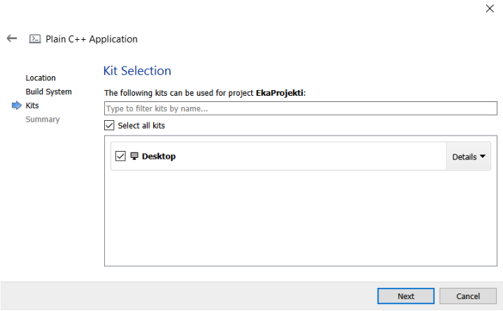
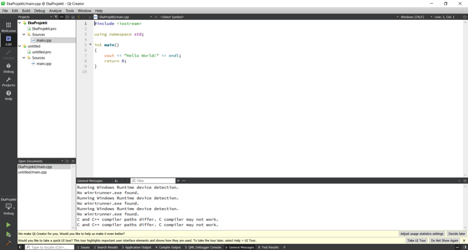
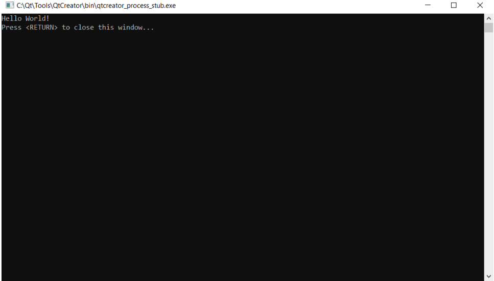
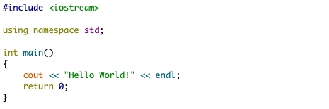

## Osa 1 - C++ lyhyesti

C++ on tehokas ohjelmointikieli, jota käytetään matalantason ohjelmien rakentamisessa. Nämä ohjelmat toimivat usein käyttöjärjestelmien perustana, sekä erilaisten laitteiden ohjaajina. C++ on vanha ohjelmointikieli, mutta se on vuosien varrella laajentunut sekä kehittynyt, ja sillä on mahdollista koodata niin pieniä sovelluksia kuin käyttöliittymän sisältäviä laajoja ohjelmia. C++ on laiteläheinen kieli, joten sillä kirjoitetuista ohjelmista on mahdollista saada hyvin tehokkaita. C++ ei itsessään sisällä suurta määrää laajennuksia, kuten esim. CSV-tiedostojen käsittelyyn tai vaikkapa käyttöliittymien rakentamiseen, mutta eri organisaatiot ja käyttäjät ovat laajentaneet C++:aa kirjastoilla. Nämä kirjastot ovat saatavilla maksutta tai maksullisina riippuen kirjaston käyttötarkoituksesta. Näin ollen lähes mikä tahansa sovellus voidaan rakentaa C++:lla. C++ on käytössä monissa yrityksissä ja mitä lähemmäs laitteiden ohjaamista työ menee sitä varmemmin yritys käyttää C++ ohjelmointikielenä. C++:n historiaa ei tällä kurssilla käydä läpi, mutta esim. GeeksForGeeks sivustolla on aiheesta hyvä
kuvaus, tämä löytyy osoitteesta: https://www.geeksforgeeks.org/history-of-c/

_Kuva 1. C++ Historia (GeeksForGeeks)_

C++ vaatii ohjelmoijalta taitoja, joiden vuoksi se on haastavan kielen maineessa. Tämä johtuu osittain C++:n historiasta, mutta pääasiassa siitä, että C++ on kielenä laiteläheinen. Muun muassa muistinhallinta ja tiedostojen käsittely on monessa muassa ohjelmointikielessä yksinkertaisempaa kuin C++:ssa, joten sillä on helppo tehdä virheitä, jotka aiheuttavat ohjelmien kaatumisen ja erilaiset virhetilanteet. Toisaalta ohjelmoijalla on lähes kaikki valta kun ohjelmoidaan C++:lla joten hän
pystyy hallitsemaan sovelluksen käyttäytymistä hyvin hienojakoisesti. Tällä kurssilla opiskelija perehtyy C++:aan niin, että hallitsee sen perusteet ja osaa luoda C++:lla sovelluksia, jotka on kirjoitettu laadukkaasti. 

Seuraavassa on kuvattuna joitain tunnuspiirteitä, jotka ovat C++:lle ominaisia:
- Yksinkertaisuus ja loogisuus, C++ muistuttaa luonnollista kieltä, ja sillä kirjoitetut ohjelmat voidaan paloitella loogisiin kokonaisuuksiin, joita on yksinkertaista hallita.
- Laiteriippumaton, mutta alustariippuvainen, C++ sovellukselle pitää määrittää
käännettäessä alusta, jolla sovellus toimii (esim. Linux tai Windows). Jokaiselle alustalle tulee kääntää oma versio lähdekoodista. Tämä tekee C++ sovelluksesta kuitenkin laiteriippumattoman, eli sama koodi toimii useissa laitteissa, kunhan ne toimivat samalla alustalla.
- Keskitason kieli, C++ kuuluu ohjelmointikielien kategoriaan, jolla voidaan tehdä niin laitteiden ohjelmointia kuin laajoja sovelluksia.
- Laaja tukikirjasto, C++:lle löytyy laaja joukko kirjastoja, joita käyttäjät ovat kirjoittaneet laajentamaan C++:n perusominaisuuksia.
- Nopeus, C++:lla kirjoitetut sovellukset saadaan optimoitua nopeiksi, koska suoritettava sovellus on konekielistä koodia. C++:ssa ei ole automaattista muistinhallintaa, roskienkeruuta tai muita ominaisuuksia, jotka helpottavat ohjelmoijaa, mutta aiheuttavat suoritettaessa ”ylimääräistä” resurssien käyttöä.
- Osoittimet ja suora muistinhallinta, C++:lla voidaan käyttää osoittimia ja hallita suoraan muistiin tallennettua tietoa. Tästä on hyötyä kun toteutetaan matalantason ohjelmia, kuten laiteohjaimia.
- Olio-ohjelmointi, vaikka C++ ei ole puhdas olio-ohjelmointi kieli mutta luetaan olioohjelmointikieleksi. Siinä ei tarvitse pakosta käyttää oliota, mutta oliopohjaisuus on C++:ssan yksi tärkeimmistä piirteistä oliot. Olioiden ja luokkien avulla voidaan tehdä sovelluksia, jotka ovat siirrettäviä ja ylläpidoltaan kevyitä

C++:lla luotuja sovelluksia ovat mm.:
- Käyttöjärjestelmät
- Selaimet
- Grafiikka ja pelimoottorit
- Tietokantapalvelimet
- Useat pilvi- / hajautetut järjestelmät
- Sulautettujen järjestelmien sovellukset

C++ on ohjelmointikieli, joka on ”helposti” luettavissa ihmiselle, sillä kirjoitettu koodi muistuttaa ulkoasultaan mitä tahansa tekstiä. Tämä tarkoittaa sitä, että C++:lla kirjoitetut ohjelmat pitää **_kääntää (compile)_** tietokoneen ymmärtämään muotoon. Tämän suorittaa _**kääntäjä (compiler)**_, jolle annetaan syötteenä C++:lla kirjoitetut tiedostot eli _**lähdekoodi (source code)**_. Kääntäjä tulkitsee C++:lla kirjoitetun ohjelman ja muuntaa sen konekieliseksi suoritettavaksi tiedostoksi _**(executable file)**_. 

Konekieliset tiedostot voidaan suorittaa suoraan tietokoneella tai muulla laitteella, nämä suoritettavat tiedostot ovat pääasiassa _**.exe muotoisia ajettavia ohjelmia**_ tai _**.dll muotoisia kirjastoja.**_ 
Konekielinen tiedosto on binäärikoodia, ja sen muodostuminen riippuu siitä, mille ympäristölle ja suorittimelle ohjelma on tarkoitettu. C++:lla voidaan siis kirjoittaa sovelluksia eri laitteille, mutta ajettavat ohjelmat tulee kääntää kohdistumaan tietylle alustalle (vrt. käyttöjärjestelmä). Näin ollen C++:lla käännettäviä ohjelmia voidaan suorittaa vain määritetyissä ympäristöissä.

Kääntäminen ja kääntäjä eivät sisälly tämän kurssin aihealueeseen, mutta seuraavassa on kuvattu kääntäjän toimintaa yleisesti. Lisätietoja kääntäjästä voi lukea esim.
https://binarymove.com/2018/12/01/how-c-works-ides-compilers-linkers/

_Kuva 2. Kääntäjän toiminta_

C++ ohjelmaa kirjoitettaessa kääntäjälle toimitetaan vähintään .cpp lähdekoodi, jonka kääntäjä tulkkaa konekieliseksi. Laajemmissa sovelluksissa kääntäjälle toimitetaan useita _lähdekooditiedostoja (.cpp)_ tiedostoja, sekä niin liittyvät _otsikkotiedostot (header file, .h)_. Otsikko- ja lähdekooditiedostoista puhutaan myöhemmin lisää. Kääntäjän toimintaa yleisesti on esitetty seuraavassa kuvassa.

_Kuva 3. Kääntäjän toiminta_

Kääntäjästä kannattaa käydä lukemassa seuraava kirjoitus, jossei heti niin vähintään kun kurssi on loppupuolella:
https://www.fi.freelancer.com/community/articles/how-c-works-understanding-compilation

## Osa 1 - Qt-Creator IDE:n asentaminen

Tällä kurssilla käytetään ohjelmointiympäristönä Qt-Creator sovellusta, sovellus sisältää niin lähdekoodieditorin kuin kääntäjän. Näin ollen ohjelmoija saa käyttöönsä kokonaisen IDE:n (Integrated Development Environment). C++ ohjelmia voi kirjoittaa millä tahansa tekstieditorilla ja sovelluksen kääntämiseen on tarjolla useita vaihtoehtoja, jotka toimivat komentoriviltä tai IDE:stä.

> Tämän kurssin esimerkit on toteutettu Qt-Creatorilla, mutta opiskelija saa halutessaan käyttää muutakin IDE:tä tai muita kääntäjiä, kuitenkaan näille ei voida kurssin aikana antaa erillistä ohjausta

## Osa 1 - Projektin luominen

Kun Qt-Creator on käynnistynyt valitse valikosta: 
`”File -> New File of Project…”`
Avautuvasta dialogista valitse 

`”Non-Qt Project”` sekä 
`”Plain C++ Application” `
näin saat luotua uuden tyhjän projektin. 
Valitse lopuksi `”Choose…”`

Anna projektille nimi: `”Eka projekti”`, tallennuspaikkana voit käyttää haluamaasi osoitetta. Qt-Creator luo tähän kansioon oman alikansion projektille. Kun tämä tehty `"Valitse next"`

> Projektit voi tallentaa esim. käyttäjän omaan Documents-kansioon ja luoda sinne Cplusplus nimisen kansion jonne luo kaikki projektit. Kannattaa kuitenkin suosi projektikansion nimessä polkua jossa ei ole välilyöntejä.

Seuraavassa dialogissa valitaan kääntäjä, tässä käytetään `”qmake” `ja paina `”Next”`

Kits-osiossa valitaan pelkkä `”Desktop”`, riippuen asennuksesta voi muitakin vaihtoehtoja olla saatavilla.

Summary osioon ei tehdä muutoksia, ja paina lopuksi `”Finish”`

Nyt sinulla pitäisi olla ensimmäinen ohjelma ja seuraava näkymä edessäsi. 

Kyseessä on Qt-Creatorin perusnäkymä. Tässä näkymässä:
-	Vasemmalla näkyvät projektin tiedostot, nyt meillä on vain yksi tiedosto main.cpp, kun haluamme kääntää suoritettavan sovelluksen tämä tiedosto lähetetään kääntäjälle. Meidän ei tarvitse huolehtia miten tämä tapahtuu, vaan IDE tekee sen puolestamme. Lisäksi näet .pro loppuisen tiedoston, nämä ovat Qt-Cretorin omia tiedostoja ja niillä hallitaan projektia, tämän kurssin aikana ei näihin tiedostoihin perehdytä.
-	Alhaalla näet ikkunan, jonne tulevat ilmoitukset kääntäjältä tai IDE:ltä.
-	Suurimman alan täyttää kuitenkin itse koodieditori, tähän kohtaan tulemme jatkossa kirjoittamaan omaa koodia. Tähän aukeaa aina .cpp tai .h tiedoston sisältö riippuen siitä minkä olet avannut.
-	Aivan vasemmasta alakulmasta löydät vihreä ”Play”-painikkeen kun painat sitä lähdekoodisi käännetään ja suoritetaan, ja sinun pitäisi saada seuraava ikkuna.

Nyt sinulla on toiminnassa toimiva ympäristö, jossa pääset kehittämään omia C++ -ohjelmiasi.

## Osa 1 - 1. C++ ohjelma

Ensimmäinen C++ -ohjelmamme näyttää siis seuraavalta:

C++ ohjelman rakenne koostuu seuraavista osista

| Materiaalin osa | Tarkoitus | Esimerkki 
|----------|-------------|-------------|
| Avainsanat | Sanat, joilla on erityinen merkitys kääntäjälle | int, float, if, float
| Tunnisteet | Sanat jotka eivät ole rakennettu kieleen | cout, std, x, funktio
| Literaalit | Sanat, jotka suoraan koodissa määrittivät arvon | "Hello, world!", 24.3, 0, ’c’
| Operaattori | Matemaattiset tai loogiset operaatiot | +, -, &&, %, <<
| Välimerkit / Erottimet | Merkit jotka luovat rakennetta | { } ( ) , ;
| Tyhjät merkit | Tyhjät merkit, joilla ei ole kääntäjälle merkitystä | Välit, tab-merkit, rivinvaihto 

**Esimerkki-ohjelman selitys rivi-riviltä**

1. Rivit jotka alkavat # merkillä ovat niin sanottuja `esikääntäjän` komentoja, ne muuttavat kirjoitettua lähdekoodia joka välitetään varsinaiselle kääntäjälle. `#include` komento kertoo esikääntäjälle, että tähän kohtaan sisällytetään sen tiedoston sisältö joka `< >-merkkien` sisään on kirjoitettu. Esimerkissä käytämme `iostream tiedostoa` joka antaa käyttöömme C++:sen syöte / tulostusfunktiot.
`#include-komennolla` voidaan hakea tiedostoja joko käyttäjän/projektin omista poluista käyttämällä lainausmerkkejä esim. `#include ”oma_header.h”` tai sitten järjestelmänpoluista käyttämällä nuolimerkkejä kuten esimerkissä. 
2. `using namespace std;` , C++:ssa funktioita voidaan kasata osaksi nimiavaruuksia (namespace), jotta niiden hallinta ja erottelu olisi helpompaa. Tätä käsitellään myöhemmin kurssilla. Nyt riittää tietää, että komennolla määritellään, että tässä koodissa käytetään `std-nimiavaruuden` funktioita/muuttujia. Nämä funktiot tulevat edellä mainitusta `iostream-tiedostosta`. 
3. Jokainen C++ ohjelma sisältää yhden `int main()` -funktion, tämä on ohjelman kohta, josta kaikki ohjelman suoritus alkaa. Funktio palauttaa kokonaismuuttuja tyyppisen arvon `(int)` sille ohjelmalle, joka on ohjelmamme on käynnistänyt. Yleensä tämä arvo on 0, jos ohjelma on suoriutunut onnistuneesti. Muut arvot kuvaavat virhetilanteita ohjelmassa. main()-funktion sisältö on rajattu lohkoksi `{...}-merkein.`
4. `cout << "Hello World!" << endl;`:
    - `cout << `, kertoo kääntäjälle että haluamma tulostaa ruudulle jotain, tämä jotain seuraa << -merkin jälkeen.
    - `"Hello World!"`, määrittää tähän kohtaan tekstityyppisen literaalin
    - ` << endl;`, yhdistää seuraavaksi tulostukseen `endl;` avainsanan, joka tarkoittaa rivinvaihtoa
5. `main-funktion` lopussa on edellä mainittu ohjelman lopetus, tämä lopetus palauttaa 0 arvon. 

> **Oppimistehtäviä:**

- Koeta kopioida rivi `cout << "Hello World!" << endl;` ja liittää se olemassa olevan rivin alle. Muuta rivin sisältöä, niin että se tulostaa oman nimesi.

- Muuta `return 0;` -> `return 1;` , tapahtuuko mitään?

- Entä jos poistat `{` -merkin, millaisia virheitä saat?, palauta nyt `{` -merkki

- Lisää `\n` sanan "Hello" jälkeen, mitä tapahtuu? Testaa myös seuraavat `\t`, `\\`, `\"`

## Osa 1 - Tehtävät

Lataa tehtävät osoitteesta:

Tässä vaiheessa sinun ei tarvitse huolehtia muusta kuin että saat tulostumaan konsoliin itsellesi 10 x kertaa "OK"
