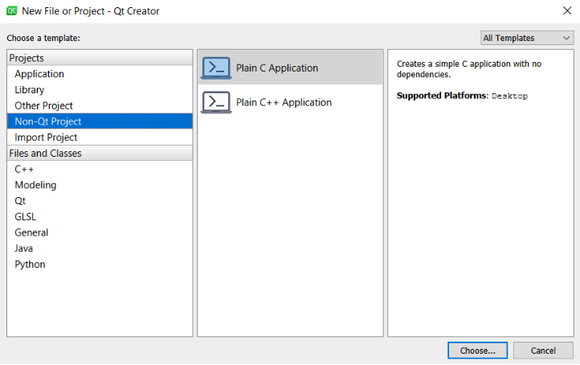
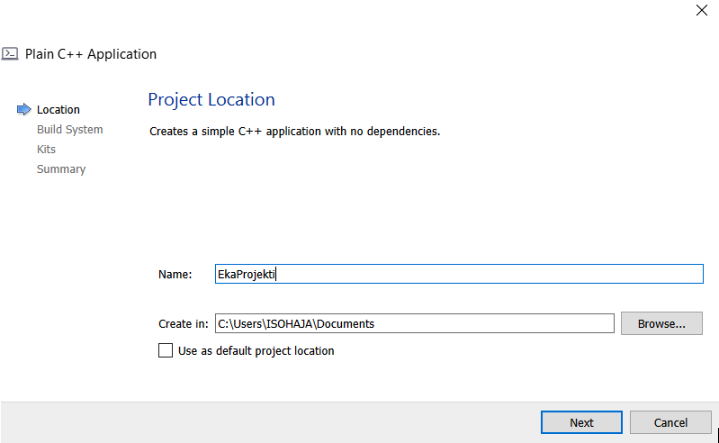
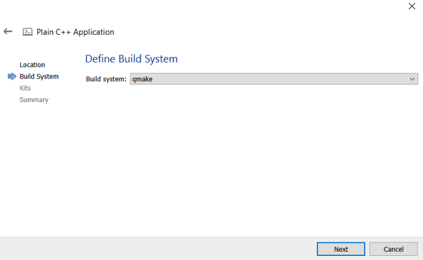
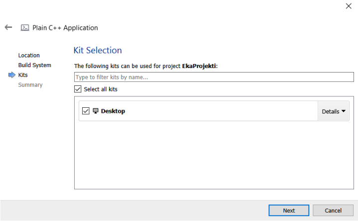
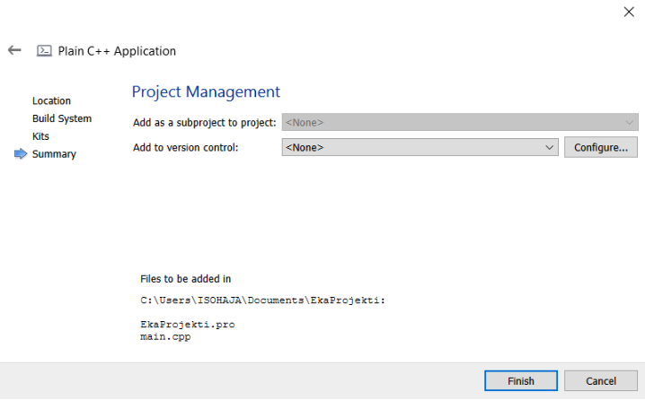
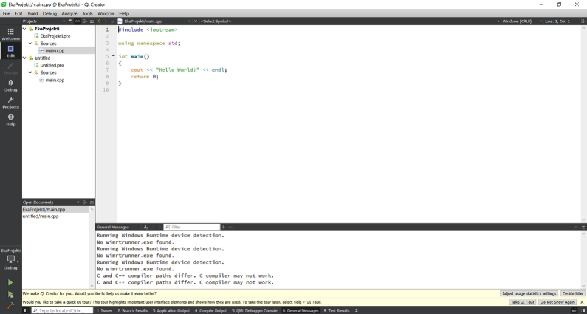
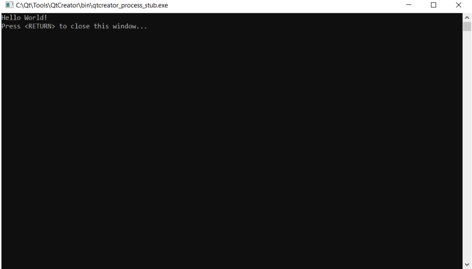
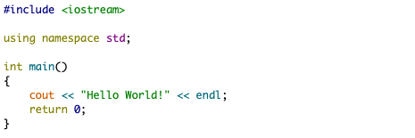

## Osa 1 - C++ lyhyesti

C++ on tehokas ohjelmointikieli, jota käytetään matalantason ohjelmien rakentamisessa. Nämä ohjelmat toimivat usein käyttöjärjestelmien perustana, sekä erilaisten laitteiden ohjaajina. C++ on vanha ohjelmointikieli, mutta se on vuosien varrella laajentunut sekä kehittynyt, ja sillä on mahdollista koodata niin pieniä sovelluksia kuin käyttöliittymän sisältäviä laajoja ohjelmia. C++ on laiteläheinen kieli, joten sillä kirjoitetuista ohjelmista on mahdollista saada hyvin tehokkaita. C++ ei itsessään sisällä suurta määrää laajennuksia, kuten esim. CSV-tiedostojen käsittelyyn tai vaikkapa käyttöliittymien rakentamiseen, mutta eri organisaatiot ja käyttäjät ovat laajentaneet C++:aa kirjastoilla. Nämä kirjastot ovat saatavilla maksutta tai maksullisina riippuen kirjaston käyttötarkoituksesta. Näin ollen lähes mikä tahansa sovellus voidaan rakentaa C++:lla. C++ on käytössä monissa yrityksissä ja mitä lähemmäs laitteiden ohjaamista työ menee sitä varmemmin yritys käyttää C++ ohjelmointikielenä. C++:n historiaa ei tällä kurssilla käydä läpi, mutta esim. GeeksForGeeks sivustolla on aiheesta hyvä
kuvaus, tämä löytyy osoitteesta: https://www.geeksforgeeks.org/history-of-c/


Kuva 1. C++ Historia (GeeksForGeeks)

C++ vaatii ohjelmoijalta taitoja, joiden vuoksi se on haastavan kielen maineessa. Tämä johtuu osittain C++:n historiasta, mutta pääasiassa siitä, että C++ on kielenä laiteläheinen. Muun muassa muistinhallinta ja tiedostojen käsittely on monessa muassa ohjelmointikielessä yksinkertaisempaa kuin C++:ssa, joten sillä on helppo tehdä virheitä, jotka aiheuttavat ohjelmien kaatumisen ja erilaiset virhetilanteet. Toisaalta ohjelmoijalla on lähes kaikki valta kun ohjelmoidaan C++:lla joten hän
pystyy hallitsemaan sovelluksen käyttäytymistä hyvin hienojakoisesti. Tällä kurssilla opiskelija perehtyy C++:aan niin, että hallitsee sen perusteet ja osaa luoda C++:lla sovelluksia, jotka on kirjoitettu laadukkaasti. 

Seuraavassa on kuvattuna joitain tunnuspiirteitä, jotka ovat C++:lle ominaisia:
- Yksinkertaisuus ja loogisuus, C++ muistuttaa luonnollista kieltä, ja sillä kirjoitetut ohjelmat voidaan paloitella loogisiin kokonaisuuksiin, joita on yksinkertaista hallita.
- Laiteriippumaton, mutta alustariippuvainen, C++ sovellukselle pitää määrittää
käännettäessä alusta, jolla sovellus toimii (esim. Linux tai Windows). Jokaiselle alustalle tulee kääntää oma versio lähdekoodista. Tämä tekee C++ sovelluksesta kuitenkin laiteriippumattoman, eli sama koodi toimii useissa laitteissa, kunhan ne toimivat samalla alustalla.
- Keskitason kieli, C++ kuuluu ohjelmointikielien kategoriaan, jolla voidaan tehdä niin laitteiden ohjelmointia kuin laajoja sovelluksia.
- Laaja tukikirjasto, C++:lle löytyy laaja joukko kirjastoja, joita käyttäjät ovat kirjoittaneet laajentamaan C++:n perusominaisuuksia.
- Nopeus, C++:lla kirjoitetut sovellukset saadaan optimoitua nopeiksi, koska suoritettava sovellus on konekielistä koodia. C++:ssa ei ole automaattista muistinhallintaa, roskienkeruuta tai muita ominaisuuksia, jotka helpottavat ohjelmoijaa, mutta aiheuttavat suoritettaessa ”ylimääräistä” resurssien käyttöä.
- Osoittimet ja suora muistinhallinta, C++:lla voidaan käyttää osoittimia ja hallita suoraan muistiin tallennettua tietoa. Tästä on hyötyä kun toteutetaan matalantason ohjelmia, kuten laiteohjaimia.
- Olio-ohjelmointi, vaikka C++ ei ole puhdas olio-ohjelmointi kieli mutta luetaan olioohjelmointikieleksi. Siinä ei tarvitse pakosta käyttää oliota, mutta oliopohjaisuus on C++:ssan yksi tärkeimmistä piirteistä oliot. Olioiden ja luokkien avulla voidaan tehdä sovelluksia, jotka ovat siirrettäviä ja ylläpidoltaan kevyitä

C++:lla luotuja sovelluksia ovat mm.:
- Käyttöjärjestelmät
- Selaimet
- Grafiikka ja pelimoottorit
- Tietokantapalvelimet
- Useat pilvi- / hajautetut järjestelmät
- Sulautettujen järjestelmien sovellukset

C++ on ohjelmointikieli, joka on ”helposti” luettavissa ihmiselle, sillä kirjoitettu koodi muistuttaa ulkoasultaan mitä tahansa tekstiä. Tämä tarkoittaa sitä, että C++:lla kirjoitetut ohjelmat pitää `kääntää (compile)` tietokoneen ymmärtämään muotoon. Tämän suorittaa `kääntäjä (compiler)`, jolle annetaan syötteenä C++:lla kirjoitetut tiedostot eli `lähdekoodi (source code)`. Kääntäjä tulkitsee C++:lla kirjoitetun ohjelman ja muuntaa sen konekieliseksi suoritettavaksi tiedostoksi `(executable file)`. 

Konekieliset tiedostot voidaan suorittaa suoraan tietokoneella tai muulla laitteella, nämä suoritettavat tiedostot ovat pääasiassa `.exe muotoisia ajettavia ohjelmia` tai .`dll muotoisia kirjastoja`. Konekielinen tiedosto on binäärikoodia, ja sen muodostuminen riippuu siitä, mille ympäristölle ja suorittimelle
ohjelma on tarkoitettu. C++:lla voidaan siis kirjoittaa sovelluksia eri laitteille, mutta ajettavat ohjelmat tulee kääntää kohdistumaan tietylle alustalle (vrt. käyttöjärjestelmä). Näin ollen C++:lla käännettäviä ohjelmia voidaan suorittaa vain määritetyissä ympäristöissä.

Kääntäminen ja kääntäjä eivät sisälly tämän kurssin aihealueeseen, mutta seuraavassa on kuvattu kääntäjän toimintaa yleisesti. Lisätietoja kääntäjästä voi lukea esim.
https://binarymove.com/2018/12/01/how-c-works-ides-compilers-linkers/


C++ ohjelmaa kirjoitettaessa kääntäjälle toimitetaan vähintään .cpp lähdekoodi, jonka kääntäjä tulkkaa konekieliseksi. Laajemmissa sovelluksissa kääntäjälle toimitetaan useita _lähdekooditiedostoja (.cpp)_ tiedostoja, sekä niin liittyvät _otsikkotiedostot (header file, .h)_. Otsikko- ja lähdekooditiedostoista puhutaan myöhemmin lisää. Kääntäjän toimintaa yleisesti on esitetty seuraavassa kuvassa.


Kääntäjästä kannattaa käydä lukemassa seuraava kirjoitus, jossei heti niin vähintään kun kurssi on loppupuolella:
https://www.fi.freelancer.com/community/articles/how-c-works-understanding-compilation


## Osa 1 - Qt-Creator IDE:n asentaminen

Tällä kurssilla käytetään ohjelmointiympäristönä Qt-Creator sovellusta, sovellus sisältää niin lähdekoodieditorin kuin kääntäjän. Näin ollen ohjelmoija saa käyttöönsä kokonaisen IDE:n (Integrated Development Environment). C++ ohjelmia voi kirjoittaa millä tahansa tekstieditorilla ja sovelluksen kääntämiseen on tarjolla useita vaihtoehtoja, jotka toimivat komentoriviltä tai IDE:stä.

> Tämän kurssin esimerkit on toteutettu Qt-Creatorilla, mutta opiskelija saa halutessaan käyttää muutakin IDE:tä tai muita kääntäjiä, kuitenkaan näille ei voida kurssin aikana antaa erillistä ohjausta

## Osa 1 - Projektin luominen

Kun Qt-Creator on käynnistynyt valitse valikosta: 
`”File -> New File of Project…”`
Avautuvasta dialogista valitse 

`”Non-Qt Project”` sekä 
`”Plain C++ Application” `
näin saat luotua uuden tyhjän projektin. 
Valitse lopuksi `”Choose…”`



Anna projektille nimi: `”Eka projekti”`, tallennuspaikkana voit käyttää haluamaasi osoitetta. Qt-Creator luo tähän kansioon oman alikansion projektille. Kun tämä tehty `"Valitse next"`

> Projektit voi tallentaa esim. käyttäjän omaan Documents-kansioon ja luoda sinne Cplusplus nimisen kansion jonne luo kaikki projektit. Kannattaa kuitenkin suosi projektikansion nimessä polkua jossa ei ole välilyöntejä.



Seuraavassa dialogissa valitaan kääntäjä, tässä käytetään `”qmake” `ja paina `”Next”`



Kits-osiossa valitaan pelkkä `”Desktop”`, riippuen asennuksesta voi muitakin vaihtoehtoja olla saatavilla.



Summary osioon ei tehdä muutoksia, ja paina lopuksi `”Finish”`



Nyt sinulla pitäisi olla ensimmäinen ohjelma ja seuraava näkymä edessäsi. 



Kyseessä on Qt-Creatorin perusnäkymä. Tässä näkymässä:
-	Vasemmalla näkyvät projektin tiedostot, nyt meillä on vain yksi tiedosto main.cpp, kun haluamme kääntää suoritettavan sovelluksen tämä tiedosto lähetetään kääntäjälle. Meidän ei tarvitse huolehtia miten tämä tapahtuu, vaan IDE tekee sen puolestamme. Lisäksi näet .pro loppuisen tiedoston, nämä ovat Qt-Cretorin omia tiedostoja ja niillä hallitaan projektia, tämän kurssin aikana ei näihin tiedostoihin perehdytä.
-	Alhaalla näet ikkunan, jonne tulevat ilmoitukset kääntäjältä tai IDE:ltä.
-	Suurimman alan täyttää kuitenkin itse koodieditori, tähän kohtaan tulemme jatkossa kirjoittamaan omaa koodia. Tähän aukeaa aina .cpp tai .h tiedoston sisältö riippuen siitä minkä olet avannut.
-	Aivan vasemmasta alakulmasta löydät vihreä ”Play”-painikkeen kun painat sitä lähdekoodisi käännetään ja suoritetaan, ja sinun pitäisi saada seuraava ikkuna.



Nyt sinulla on toiminnassa toimiva ympäristö, jossa pääset kehittämään omia C++ -ohjelmiasi.

## Osa 1 - 1. C++ ohjelma

Ensimmäinen C++ -ohjelmamme näyttää siis seuraavalta:



C++ ohjelman rakenne koostuu seuraavista osista

| Materiaalin osa | Tarkoitus | Esimerkki 
|----------|-------------|-------------|
| Avainsanat | Sanat, joilla on erityinen merkitys kääntäjälle | int, float, if, float
| Tunnisteet | Sanat jotka eivät ole rakennettu kieleen | cout, std, x, funktio
| Literaalit | Sanat, jotka suoraan koodissa määrittivät arvon | "Hello, world!", 24.3, 0, ’c’
| Operaattori | Matemaattiset tai loogiset operaatiot | +, -, &&, %, <<
| Välimerkit / Erottimet | Merkit jotka luovat rakennetta | { } ( ) , ;
| Tyhjät merkit | Tyhjät merkit, joilla ei ole kääntäjälle merkitystä | Välit, tab-merkit, rivinvaihto 

**Esimerkki-ohjelman selitys rivi-riviltä**

1. Rivit jotka alkavat # merkillä ovat niin sanottuja `esikääntäjän` komentoja, ne muuttavat kirjoitettua lähdekoodia joka välitetään varsinaiselle kääntäjälle. `#include` komento kertoo esikääntäjälle, että tähän kohtaan sisällytetään sen tiedoston sisältö joka `< >-merkkien` sisään on kirjoitettu. Esimerkissä käytämme `iostream tiedostoa` joka antaa käyttöömme C++:sen syöte / tulostusfunktiot.
`#include-komennolla` voidaan hakea tiedostoja joko käyttäjän/projektin omista poluista käyttämällä lainausmerkkejä esim. `#include ”oma_header.h”` tai sitten järjestelmänpoluista käyttämällä nuolimerkkejä kuten esimerkissä. 
2. `using namespace std;` , C++:ssa funktioita voidaan kasata osaksi nimiavaruuksia (namespace), jotta niiden hallinta ja erottelu olisi helpompaa. Tätä käsitellään myöhemmin kurssilla. Nyt riittää tietää, että komennolla määritellään, että tässä koodissa käytetään `std-nimiavaruuden` funktioita/muuttujia. Nämä funktiot tulevat edellä mainitusta `iostream-tiedostosta`. 
3. Jokainen C++ ohjelma sisältää yhden `int main()` -funktion, tämä on ohjelman kohta, josta kaikki ohjelman suoritus alkaa. Funktio palauttaa kokonaismuuttuja tyyppisen arvon `(int)` sille ohjelmalle, joka on ohjelmamme on käynnistänyt. Yleensä tämä arvo on 0, jos ohjelma on suoriutunut onnistuneesti. Muut arvot kuvaavat virhetilanteita ohjelmassa. main()-funktion sisältö on rajattu lohkoksi `{...}-merkein.`
4. `cout << "Hello World!" << endl;`:
    - `cout << `, kertoo kääntäjälle että haluamma tulostaa ruudulle jotain, tämä jotain seuraa << -merkin jälkeen.
    - `"Hello World!"`, määrittää tähän kohtaan tekstityyppisen literaalin
    - ` << endl;`, yhdistää seuraavaksi tulostukseen `endl;` avainsanan, joka tarkoittaa rivinvaihtoa
5. `main-funktion` lopussa on edellä mainittu ohjelman lopetus, tämä lopetus palauttaa 0 arvon. 


> **Oppimistehtäviä:**

- Koeta kopioida rivi `cout << "Hello World!" << endl;` ja liittää se olemassa olevan rivin alle. Muuta rivin sisältöä, niin että se tulostaa oman nimesi.

- Muuta `return 0;` -> `return 1;` , tapahtuuko mitään?

- Entä jos poistat `{` -merkin, millaisia virheitä saat?, palauta nyt `{` -merkki

- Lisää `\n` sanan "Hello" jälkeen, mitä tapahtuu? Testaa myös seuraavat `\t`, `\\`, `\"`


## Osa 1 - C++ kielen perusrakenteita

Ohjelmamme ei nyt varsinaisesti tee vielä mitään, tehdään siihen muutamia muutoksia. Mutta aluksi muutamia perusteita joiden varaan C++ -ohjelma rakentuu.

**Lauseet ja lausekkeet**

- Lause on koodin yksikkö, joka tekee jotain
- Lauseke on lause, jolla on arvo - esimerkiksi "Hello World", 42, 4 + 2.

Jokainen lause ei välttämättä ole lauseke, sillä lause ei välttämättä tuota arvoa, kuten `#include`

**Aritmeettiset operaattori**

Voimme suorittaa aritmeettisiä laskelmia operaattoreiden avulla. Operaattorit toimivat osana lausekkeita, ja ne tuottavat uuden lausekkeen kunnes lopullinen arvo muodostuu. Esimerkiksi (8 + 10) / 2 lauseke sisältää operaattoreita ja tuottaa lopulta tuloksen 9. Voisit sijoitaa `(8 + 10) / 2`, korvaamaan `"Hello World"` tekstin edellisessä esimerkissämme ja saisit ruudulle tulostumaan arvon 9.

Lausekkeessa (8 + 10) / 2, ovat operaattorit + sekä / ja operandit 8, 10, 2. Huomaa että C++:san laskujärjestys noudattaa matematiikan sääntöjä.

Operaattorityyypit:

- Matemaattiset: +, -, *, /, ja sulkeet (), toimivat kuten ne toimivat muissa ohjelmointikielissä tai matematiikassa. Jakojäännöksen voi toteuttaa % operaattorilla, esim 6 % 5 tuottaa tuloksen 1

- Loogiset: 
    - && (ja, and) 
    - || (tai, or) 
    - ! (not, epätosi)

- Bittien käsittely: 
    - & | ^ vertaavat alkioita bitti kerrallaan ja palauttavat
    - << >> siirtävät bittejä sanan sisällä
    - ~ yhden komplementti 0-> 1 ja 1-> 0

**Tietotyypit**

Jokainen lauske päättyy tulokseen jossa arvo jonka lauseke tuottaa edustaa jotain tietotyyppiä. Näin koodia suorittava suoritin tietää miten muistissa olevaa tietoa pitäisi tulkita. 

Esimerkiksi koodissa olevat arvot voidaan tulkita seuraavasti:

- 0 on kokonaisluku (int)
- 3.1415 on liukuluku (float) 
- "Hello, world!" on tekstiä (string)

C++:ssan sisäänrakennetut suosituimmat tietotyypit ovat seuraavat, koko määritelty 32-bittisessä järjestelmässä:

| Nimi | Kuvaus | Koko | Arvoalue 
|----------|-------------|-------------|-------------|
| bool | Totuusarvo, voi olla tosi (true) tai epätosi (false), määritellään sanoilla true/false koodissa | 1 tavua | true tai false
| char | Pieni kokonaisluku tai kirjaimen numeerinen arvo, määritellään koodissa ''-merkkien sisään, esim `'a'` tai `'3'` | 1 tavua | signed: -128 ... 127 sekä unsigned: 0 ... 255
| int | Kokonaisluku | 4 tavua | signed: -2147483648 ... 2147483647 unsigned: 0 .. 4294967295
| double | Tuplatarkkuuden liukuluku | 8 tavua | +/- 1.7e +/- 308 ( 15 merkkiä)

`signed` tarkoittaa että luku voi esittää negatiivisia ja/tai positiviisia lukuja, kun taas `unsigned` tarkoittaa että luku voi esittää vain positiivisia lukuja. Jos tätä ei määritetä suurinosa käyttjistä tulkitsee luvun `signed`versiona.

C++:ssa on oikeasti 3 kokonaislukutyyppiä, `short`, `int` ja `long`. Jos on tarve säästää muistia voi käytää `short` tyyppistä muuttujaa (-32768 ... 32767) tai jos olet varma että on tarve isoille luvuille voit käyttää `long` tyyppistä muuttujaa.

Sama koskee myös liukuluku tyyppejä, C++:ssä on mahdollista käyttää `float`, `double`, ja `long double` tietotyyppejä. Nämä eroavat tarkkuuden puolesta.

Lisää tietoa tietotyypeistä löydät esim: https://www.tutorialspoint.com/cplusplus/cpp_data_types.htm


Operaatiot voidaan toteuttaa vain niillä tietotyypeillä, jotka ovat tuettuina operaation toimesta. Esimerkiksi kokonaisluvusta ei voida ottaa jakojäännöstä liukuluvulla.

C++ muuttaa eri tilanteissa automaattisesti tyyppiä tarvittaessa. Jos operaattorin eri puolilla käytetään eri tietotyyppiä, laajennetaan suppeampi/pienempi tyyppi. Laajentamista on havainnollistettu seuraavassa:

```
4/8

Tässä tapauksessa toteutetaan kokonaislukujen 4 ja 8 jakolasku, jolloin vastaukseksi saadaan 0. Tämä sen vuoksi, että molemmat laskettavat ovat kokonaislukuja ja tuloksen kokonaisluku osuus on 0. Vaikka lopputulos liukulukuna olisi 0.5 niin C++:ssa loppuosa katkaistaan pois kun tehdään kokonaisluvuilla jakamista.

Jos lasku toteutettaisiin seuraavasti:

4.0/8 

Laajennetaan kokonaisluku 8 liukuluvuksi, jolloin tulokseksi saadaan 0.5. Laajentamista ei tarvita, jos molemmat luvut ovat valmiiksi liukulukuja.

Tietotyypille voidaan pakottaa muutos, laittamalla haluttu tyyppi sulkujen kanssa muutettavan arvon eteen. Sulut voidaan laittaa joko muutettavan arvon tai tyypin ympärille:

double(4)/8 

Tuottaa tuloksen 0.5, samoin kuin 

(double)4/8 


```

C++:ssa kuten muissakin ohjelmointikielissä käytetään numerojärjestelmää jossa kantalukuna on 10, jos haluat käyttää muuta numerojärjestelmää kuten 8 tai 16, se onnistuu seuraavasti:

Jos haluat esittää luvun numerojärjestelmässä jossa 8 on kantaluku, kirjoita numeron ensimmäiseksi numero 0. Tämä jälkeen numero 8-järjestelmässä:

`esim. 0123 vastaa kymmenjärjestelmän lukua 83`

Vastaavasti hexagonaalijärjestelmässä, missä kantaluku on 16, luvut esitetään laittamalla niiden alkuun 0x.

`esim. 0x123 vastaa kymmenjärjestelmän lukua 291`


> **Oppimistehtäviä:**

- Testaa erilaisia matemaattisia laskutoimituksia korvaavammalla seuraavassa lausekkeessa X, jolloin matemaattisella lauskeella: `cout << X << endl;` 
esim. `cout << 2/4 << endl;` 

- Testaa myös tulosta mistä oktagonaali ja hexagonaali luvuilla

**Muuttujat**

Jotta voisimme järkevästi käyttää arvoja, emmekä laskea niitä aina uudestaan, tarvitsemme tavan jolla säilytämme ja nimeämme niitä.  Tätä arkoitusta varten on olemassa erityisiä "laatikoita", joita kutsutaan muuttujiksi. Kuten nimi muuttuja viittaava, säiliön sisältöä voidaan muuttaa (melkein) millään tavalla tahansa. 


Muuttujat, kuva Cisco Networking Academy

C++:ssa jokaiselle muuttujalle tulee määrittää:
- nimi
- tietotyypi
- arvo

Periaatteessa arvo voidaan jäättää määrittämättä, tällöin arvo on satunnainen. Tämä johtuu siitä, että jokaiselle muuttujalle varataan muistista tilaa ja jos emme alusta muuttujaa arvolla saa se arvoksi sen mitä kyseissä muistiosoitteessa on tietona sillä hetkellä.

Yksinkertainen esimerkki muuttujan käytöstä, on seuraavassa. Määrittelemme _(declaration)_ kokonaisluku `(int)` tyyppisen muuttujan, ja annamme sille nimen `x` sekä alustamme _(initialization)_ arvoksi laskutoimituksen `4 + 2` tuloksen. Arvo sijoitetaan muuttujaan aina `=` operaattorilla. 
```
int x = 4 + 2;
cout << "X:n arvo on: " << x << endl;

float y = 4.0 / 2.0;
cout << "Y:n arvo on: " << y << endl;
```

Muuttujien nimeämisessä on seuraavat säännöt:
- Nimi voi sisältää ISOJA ja pieniä kirjamia sekä niiden sekoituksia, numeroita ja muita latinalaisen aakkoston merkkejä. Myös alaviiva _ on sallittu muuttujan nimessä.
- Muuttujan nimen tulee alkaa kirjaimella tai alaviivalla
- Isot ja pienet kirjaimet ovat eriarvoisia, eli auto1 ja AuTo1 ovat eri muuttujat.

Nämä säännöt itseasiassa pätevät kaikkiin nimeämisiin joita C++:ssa tehdään, funktiota, luokat, jne...

Esimerkkejä oikein nimetyistä (mutta ei välttämättä käytännöllisistä) muuttujista seuraavassa:
```
i
t10
Exchange_Rate
counter
DaysToTheEndOfTheWorld
TheNameOfAVariableWhichIsSoLongThatYouWillNotBeAbleToWriteItWithoutMistakes

```

Kun taas seuraavat eivät ole sallittuja:

```
10t (ei ala kirjaimella)
Adiós_Señora (vääriä merkkejä)
Exchange Rate (sisältää välilyönnin)

```

Voit määritellä kerralla yhden muuttujan tai monta saman tietotyypin muuttujaa.

```
//Määritellään kolme int -tyyppistä muuttujaa
int autojen_lkm, mopojen_lkm, pyorien_lkm;

```

**Varatut sanat (keywords)**

C++:ssa on jonkinverran varattuja sanoja, näitä sanoja ei voi käyttää yksinään muuttujan tai funktion nimessä. Seuraavassa kuvassa on listattuna nämä sanat.


**Syötteen pyytäminen käyttäjältä**

Komentoriviohjelmissa voidaan käyttäjältä pyytää syöte käyttämällä iostream-kirjaston `cin -funktiota`. Tämä funktio toimii kuten `cout`, mutta sille annetaan muuttuja, johon käyttäjän syöttämä arvo sijoitetaan. 

Esimerkiksi seuraava kysyy käyttäjältä x:n arvoa:

```
#include < iostream >
using namespace std;

int main () 
{
    cout << "Anna x:n arvo: ";
    int x ;
    cin >> x ;
    cout << x / 3 << ’ ’ << x * 2;

    return 0;
}

```

**Kommentointi**

C++:ssa on seuraavat kommentointi ominaisuudet. Kääntäjä ei huomioi tekstiä, joka on kommentoitua. 

`// `näiden merkkien jälkeen rivillä oleva loppu teksti on kommentoitu tekstiä, tämä on ns. yhden rivin kommentti 


`/*` merkki aloitaa vastaavasti kommentin, joka voi olla useita rivejä
`*/` merkit päättävät pitkän kommentin. 

```
// Hei tässä on lyhyt kommentti

/* Tämä kommentti on pitkä ja voi jakaantua
usealle riville */

```
> **Oppimistehtäviä:**

- Lisää esimerkkitehtävään kommentti joka on usemman rivin mittainen ja kertoo kuka koodin on tehnyt sekä `return 0;` lauseen perään yhden rivin kommentti, jossa kuvataan miksi pitää palauttaa 0


## Osa 1 - Tehtävät

Lataa tehtävät osoitteesta:

Tässä vaiheessa sinun ei tarvitse huolehtia muusta kuin että saat tulostumaan konsoliin itsellesi 10 x kertaa "OK"
