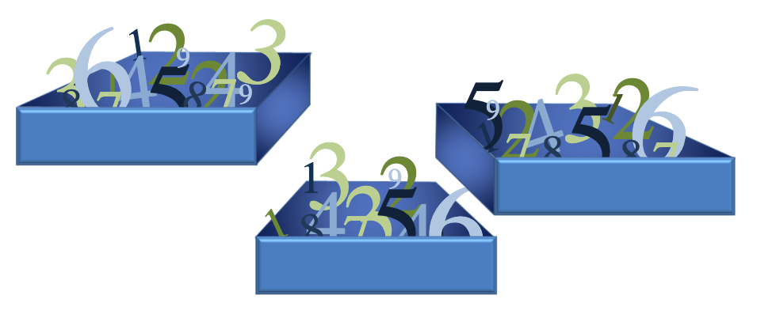
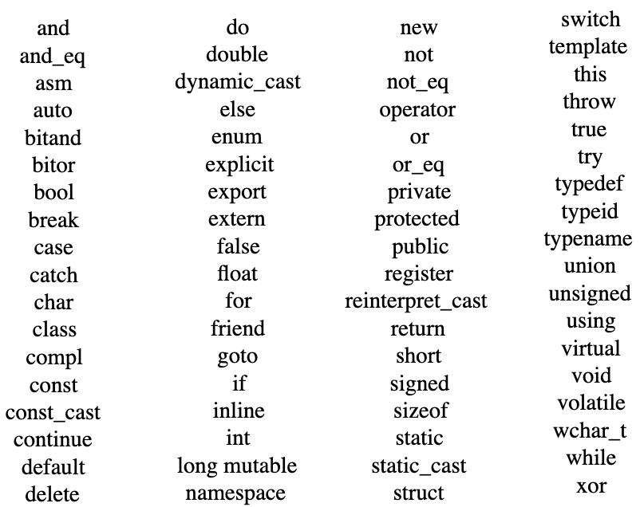

## Osa 2 - C++ kielen perusrakenteita

Ohjelmamme ei nyt varsinaisesti tee vielä mitään, tehdään siihen muutamia muutoksia. Mutta aluksi muutamia perusteita joiden varaan C++ -ohjelma rakentuu.

**Lauseet ja lausekkeet**

- Lause on koodin yksikkö, joka tekee jotain
- Lauseke on lause, jolla on arvo - esimerkiksi "Hello World", 42, 4 + 2.

Jokainen lause ei välttämättä ole lauseke, sillä lause ei välttämättä tuota arvoa, kuten `#include`

**Aritmeettiset operaattori**

Voimme suorittaa aritmeettisiä laskelmia operaattoreiden avulla. Operaattorit toimivat osana lausekkeita, ja ne tuottavat uuden lausekkeen kunnes lopullinen arvo muodostuu. Esimerkiksi (8 + 10) / 2 lauseke sisältää operaattoreita ja tuottaa lopulta tuloksen 9. Voisit sijoitaa `(8 + 10) / 2`, korvaamaan `"Hello World"` tekstin edellisessä esimerkissämme ja saisit ruudulle tulostumaan arvon 9.

Lausekkeessa (8 + 10) / 2, ovat operaattorit + sekä / ja operandit 8, 10, 2. Huomaa että C++:san laskujärjestys noudattaa matematiikan sääntöjä.

Operaattorityyypit:

- Matemaattiset: +, -, *, /, ja sulkeet (), toimivat kuten ne toimivat muissa ohjelmointikielissä tai matematiikassa. Jakojäännöksen voi toteuttaa % operaattorilla, esim 6 % 5 tuottaa tuloksen 1

- Loogiset: 
    - && (ja, and)
    - || (tai, or)
    - ! (not, epätosi)

- Bittien käsittely: 
    - & | ^ vertaavat alkioita bitti kerrallaan ja palauttavat
    - << >> siirtävät bittejä sanan sisällä
    - ~ yhden komplementti 0-> 1 ja 1-> 0

**Tietotyypit**

Jokainen lauske päättyy tulokseen jossa arvo jonka lauseke tuottaa edustaa jotain tietotyyppiä. Näin koodia suorittava suoritin tietää miten muistissa olevaa tietoa pitäisi tulkita. 

Esimerkiksi koodissa olevat arvot voidaan tulkita seuraavasti:

- 0 on kokonaisluku (int)
- 3.1415 on liukuluku (float) 
- "Hello, world!" on tekstiä (string)

C++:ssan sisäänrakennetut suosituimmat tietotyypit ovat seuraavat, koko määritelty 32-bittisessä järjestelmässä:

| Nimi | Kuvaus | Koko | Arvoalue 
|----------|-------------|-------------|-------------|
| bool | Totuusarvo, voi olla tosi (true) tai epätosi (false), määritellään sanoilla true/false koodissa | 1 tavua | true tai false
| char | Pieni kokonaisluku tai kirjaimen numeerinen arvo, määritellään koodissa ''-merkkien sisään, esim `'a'` tai `'3'` | 1 tavua | signed: -128 ... 127 sekä unsigned: 0 ... 255
| int | Kokonaisluku | 4 tavua | signed: -2147483648 ... 2147483647 unsigned: 0 .. 4294967295
| double | Tuplatarkkuuden liukuluku | 8 tavua | +/- 1.7e +/- 308 ( 15 merkkiä)

`signed` tarkoittaa että luku voi esittää negatiivisia ja/tai positiviisia lukuja, kun taas `unsigned` tarkoittaa että luku voi esittää vain positiivisia lukuja. Jos tätä ei määritetä suurinosa käyttjistä tulkitsee luvun `signed`versiona.

C++:ssa on oikeasti 3 kokonaislukutyyppiä, `short`, `int` ja `long`. Jos on tarve säästää muistia voi käytää `short` tyyppistä muuttujaa (-32768 ... 32767) tai jos olet varma että on tarve isoille luvuille voit käyttää `long` tyyppistä muuttujaa.

Sama koskee myös liukuluku tyyppejä, C++:ssä on mahdollista käyttää `float`, `double`, ja `long double` tietotyyppejä. Nämä eroavat tarkkuuden puolesta.

Lisää tietoa tietotyypeistä löydät esim: https://www.tutorialspoint.com/cplusplus/cpp_data_types.htm


Operaatiot voidaan toteuttaa vain niillä tietotyypeillä, jotka ovat tuettuina operaation toimesta. Esimerkiksi kokonaisluvusta ei voida ottaa jakojäännöstä liukuluvulla.

C++ muuttaa eri tilanteissa automaattisesti tyyppiä tarvittaessa. Jos operaattorin eri puolilla käytetään eri tietotyyppiä, laajennetaan suppeampi/pienempi tyyppi. Laajentamista on havainnollistettu seuraavassa:

```
4/8

Tässä tapauksessa toteutetaan kokonaislukujen 4 ja 8 jakolasku, jolloin vastaukseksi saadaan 0. Tämä sen vuoksi, että molemmat laskettavat ovat kokonaislukuja ja tuloksen kokonaisluku osuus on 0. Vaikka lopputulos liukulukuna olisi 0.5 niin C++:ssa loppuosa katkaistaan pois kun tehdään kokonaisluvuilla jakamista.

Jos lasku toteutettaisiin seuraavasti:

4.0/8 

Laajennetaan kokonaisluku 8 liukuluvuksi, jolloin tulokseksi saadaan 0.5. Laajentamista ei tarvita, jos molemmat luvut ovat valmiiksi liukulukuja.

Tietotyypille voidaan pakottaa muutos, laittamalla haluttu tyyppi sulkujen kanssa muutettavan arvon eteen. Sulut voidaan laittaa joko muutettavan arvon tai tyypin ympärille:

double(4)/8 

Tuottaa tuloksen 0.5, samoin kuin 

(double)4/8 


```

C++:ssa kuten muissakin ohjelmointikielissä käytetään numerojärjestelmää jossa kantalukuna on 10, jos haluat käyttää muuta numerojärjestelmää kuten 8 tai 16, se onnistuu seuraavasti:

Jos haluat esittää luvun numerojärjestelmässä jossa 8 on kantaluku, kirjoita numeron ensimmäiseksi numero 0. Tämä jälkeen numero 8-järjestelmässä:

`esim. 0123 vastaa kymmenjärjestelmän lukua 83`

Vastaavasti hexagonaalijärjestelmässä, missä kantaluku on 16, luvut esitetään laittamalla niiden alkuun 0x.

`esim. 0x123 vastaa kymmenjärjestelmän lukua 291`


> **Oppimistehtäviä:**

- Testaa erilaisia matemaattisia laskutoimituksia korvaavammalla seuraavassa lausekkeessa X, jolloin matemaattisella lauskeella: `cout << X << endl;` 
esim. `cout << 2/4 << endl;` 

- Testaa myös tulosta mistä oktagonaali ja hexagonaali luvuilla

**Muuttujat**

Jotta voisimme järkevästi käyttää arvoja, emmekä laskea niitä aina uudestaan, tarvitsemme tavan jolla säilytämme ja nimeämme niitä.  Tätä arkoitusta varten on olemassa erityisiä "laatikoita", joita kutsutaan muuttujiksi. Kuten nimi muuttuja viittaava, säiliön sisältöä voidaan muuttaa (melkein) millään tavalla tahansa. 


Muuttujat, kuva Cisco Networking Academy

C++:ssa jokaiselle muuttujalle tulee määrittää:
- nimi
- tietotyypi
- arvo

Periaatteessa arvo voidaan jäättää määrittämättä, tällöin arvo on satunnainen. Tämä johtuu siitä, että jokaiselle muuttujalle varataan muistista tilaa ja jos emme alusta muuttujaa arvolla saa se arvoksi sen mitä kyseissä muistiosoitteessa on tietona sillä hetkellä.

Yksinkertainen esimerkki muuttujan käytöstä, on seuraavassa. Määrittelemme _(declaration)_ kokonaisluku `(int)` tyyppisen muuttujan, ja annamme sille nimen `x` sekä alustamme _(initialization)_ arvoksi laskutoimituksen `4 + 2` tuloksen. Arvo sijoitetaan muuttujaan aina `=` operaattorilla. 
```
int x = 4 + 2;
cout << "X:n arvo on: " << x << endl;

float y = 4.0 / 2.0;
cout << "Y:n arvo on: " << y << endl;
```

Muuttujien nimeämisessä on seuraavat säännöt:
- Nimi voi sisältää ISOJA ja pieniä kirjamia sekä niiden sekoituksia, numeroita ja muita latinalaisen aakkoston merkkejä. Myös alaviiva _ on sallittu muuttujan nimessä.
- Muuttujan nimen tulee alkaa kirjaimella tai alaviivalla
- Isot ja pienet kirjaimet ovat eriarvoisia, eli auto1 ja AuTo1 ovat eri muuttujat.

Nämä säännöt itseasiassa pätevät kaikkiin nimeämisiin joita C++:ssa tehdään, funktiota, luokat, jne...

Esimerkkejä oikein nimetyistä (mutta ei välttämättä käytännöllisistä) muuttujista seuraavassa:
```
i
t10
Exchange_Rate
counter
DaysToTheEndOfTheWorld
TheNameOfAVariableWhichIsSoLongThatYouWillNotBeAbleToWriteItWithoutMistakes

```

Kun taas seuraavat eivät ole sallittuja:

```
10t (ei ala kirjaimella)
Adiós_Señora (vääriä merkkejä)
Exchange Rate (sisältää välilyönnin)

```

Voit määritellä kerralla yhden muuttujan tai monta saman tietotyypin muuttujaa.

```
//Määritellään kolme int -tyyppistä muuttujaa
int autojen_lkm, mopojen_lkm, pyorien_lkm;

```

**Varatut sanat (keywords)**

C++:ssa on jonkinverran varattuja sanoja, näitä sanoja ei voi käyttää yksinään muuttujan tai funktion nimessä. Seuraavassa kuvassa on listattuna nämä sanat.



**Syötteen pyytäminen käyttäjältä**

Komentoriviohjelmissa voidaan käyttäjältä pyytää syöte käyttämällä iostream-kirjaston `cin -funktiota`. Tämä funktio toimii kuten `cout`, mutta sille annetaan muuttuja, johon käyttäjän syöttämä arvo sijoitetaan. 

Esimerkiksi seuraava kysyy käyttäjältä x:n arvoa:

```
#include < iostream >
using namespace std;

int main () 
{
    cout << "Anna x:n arvo: ";
    int x ;
    cin >> x ;
    cout << x / 3 << ’ ’ << x * 2;

    return 0;
}

```

**Vakiot**
Vakio on lauseke jolla on määritetty (vakio) arvi0. Vakiot voidaan jakaa seuraaviin tyyppeihin:
- Literaalit, esim, luvut, tekstit, tottuusarvo
- Määritellyt vakiot, käyttäjän määrittelemät vakiot joita ei sijoiteta muuttujiin. Nämä määritellään `#define` esikääntäjä lausekkeella. Ja esikääntä korvaa ilmentymät vakiolla kun löytää sen koodin seasta. 

esim
A constant is an expressions with a fixed value. Kinds of constants:
• Literals: used to express particular values within the source code; can be integers (ex:
1, −0, -17), floating points (ex: 3.1415926535897, 1., 6.096, 3), characters (ex: ‘a’, ‘ ’,
‘\n’), strings (ex: “6.096”, “a”), booleans (ex: true, false)
• Defined constants (#define): user-defined named constants that do not require memoryconsuming variables. When the preprocessor sees the #define, it will replace every
subsequent occurrance of the identifier in the source code.

**Kommentointi**

C++:ssa on seuraavat kommentointi ominaisuudet. Kääntäjä ei huomioi tekstiä, joka on kommentoitua. 

`// `näiden merkkien jälkeen rivillä oleva loppu teksti on kommentoitu tekstiä, tämä on ns. yhden rivin kommentti 


`/*` merkki aloitaa vastaavasti kommentin, joka voi olla useita rivejä
`*/` merkit päättävät pitkän kommentin. 

```
// Hei tässä on lyhyt kommentti

/* Tämä kommentti on pitkä ja voi jakaantua
usealle riville */

```
> **Oppimistehtäviä:**

- Lisää esimerkkitehtävään kommentti joka on usemman rivin mittainen ja kertoo kuka koodin on tehnyt sekä `return 0;` lauseen perään yhden rivin kommentti, jossa kuvataan miksi pitää palauttaa 0

