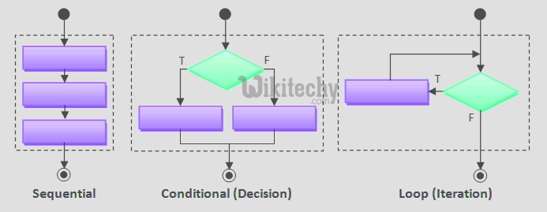
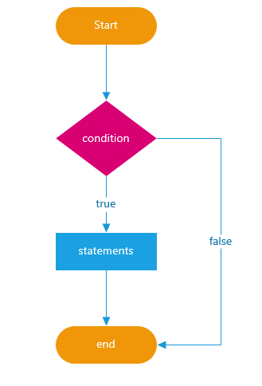
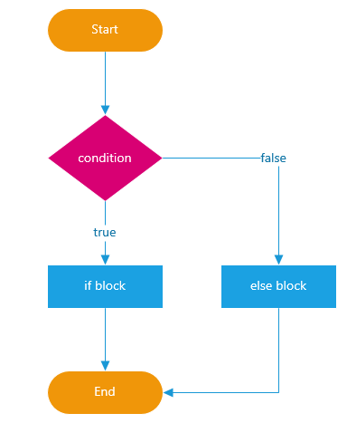
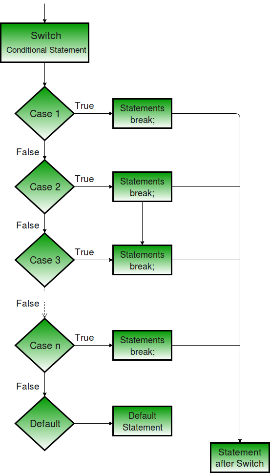
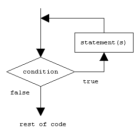

# Osa 2 - Ohjausrakenteita

Normaalisti C++:ssa kuten muissakin ohjelmointikielissä, ohjelma suoritetaan alusta loppuun lausekkeiden mukaisessa järjestyksessä. Tätä kutsutaan niin sanotuksi peräkkäissuorittamiseksi (Sequential). Lausekkeita suoritetaan niin kauan kuin niitä riittää, tämän jälkeen ohjelman suorittaminen loppuu.

Harvat ohjelmat ovat hyödyllisiä jos ne suorittavat samat lausekkeet aina jokaisella kerralla. Tai vähintäänkin hyödyllisemmät ohjelmat mukautuvat suoritusympräistön ja käyttäjän toimien mukaisesti.

Tämän toteuttamiseen vaaditaan ohjausrakenteita, jotta voidaan esimerkiksi mukauttaa toimintaa riippuen siitä mitä nappia käyttäjä painaa tai sisältääkö avattu tiedosto tiettyjä sanoja.

Ohjelmoinnissa voidaan käyttää kahdenlaisia ohjausrakenteita:
- Ehtorakenteet (Conditionals)
- Silmukkarakenteet (Loop)



_Kuva 1. C++ ohjausrakenteita (Wikitechy)_, lähde: https://www.wikitechy.com/tutorials/c++/c++-flow-control

## Ehtorakenteet

Jotta ohjelma voi tarpeen mukaan haarautua ja näin ollen suorittaa erilaisia peräkkäisiä lauseita, tarvitaan ehtorakenne. Ehtorakenne perustuu syötteeseen, jonka arvoa validoitaan ja validoinnin perusteella edetään eri haaroihin (tai jätetään haarautuminen suorittamatta). C++:ssa haarautumiseen on käytössä kaksi ehtorakennetta:
- If -rakenne
- switch-case -rakenne

### Ehtojen testaaminen

Ehtojen totuusarvojen testaamisessa käytetään kahden luokan operaattoreita, **loogiset** sekä **relationaaliset**. Näiden operaattoreiden tuottama tulos on aina joko **true** tai **false**

Relaatio-operaatiot kuvaavat kahden arvon suhdetta toisiinsa, ne ovat esitettynä seuraavassa taulukossa.

| Operaattori | Tarkoitus | Esimerkki (tuottaa true jos x = 5)
|----------|-------------|-------------|
| > | Suurempi kuin | x > 5 |
| >= | Suurempi tai yhtäsuuri | x => 5 |
| < | Pienempi kuin | x < 6 |
| <= | Pienempi tai yhtäsuuri| x <=5 |
| == | Yhtäsuuri | x == 5 |
| != | Erisuuri | x != 6 |

Edellä kuvatut operaattorit toimivat kuten aritmeettiset operaatiot, mutta tuottavat siis **true/false**, näitä lauseita kutsutaankin totuuslauseiksi _(Boolean expression)_.

Loogisia operaatioita voidaan yhdistää relaatio-operaatioiden kautta. Näin voidaan muodostaa entistä monimutkaisempia totuuslauseita. Reelaatiooperaatioita voidaan ryhmitellä sulkeiden avulla, jotta saadaan haluttu suoritusjärjestys. **HUOM! Molempien relaatio ja loogisten operaattoreiden suoritusjärjestys on vasemmalta oikealle.**

| Operaattori | Tarkoitus | Esimerkki
|----------|-------------|-------------|
| && | JA / AND | x > 5 && y > 5 |
| \|\| | TAI / OR | x > 5 || y > 5 |
| ! | EI / NOT | !x |

Seuraavassa taulukossa on havainnollistettu loogiste operaatioiden tuottamia arvoja

| a | b | a && b
|----------|-------------|-------------|
| true | true | true |
| false | true | false |
| true | false | false |
| false | false | false |

| a | b | a \|\| b
|----------|-------------|-------------|
| true | true | true |
| false | true | true |
| true | false | true |
| false | false | false |


| a | !a 
|----------|-------------|
| true | false |
| false | true | 

Muutama esimerkki loogisten operaatioiden ja relaatio-operaatioiden käytöstä

```C++
int x = 10;
int y = 5;

!(x > 5) → false
(x > y) && (y > 0) → true
(x < y) && (y > 0) → false
(x < y) || (y > 0) → true

```

Edellisissä lauseissa voitaisiin käyttää myös suoreen **Boolean (bool)** tyyppisiä muuttujia, koska ne sisältävät true tai false arvon. Toisaalta C++:ssa mikä tahansa muuttuja toimii totuusarvoja, sillä C++:ssa arvo **0 = false** ja nollasta eroava arvo on **true**. Tätä on havainnollistettu seuraavassa

```C++
bool totuus_arvo = false;

(0) → false
(2) → true
(-2) → true
(1000) → true
```

## if, if-else and else if lauseet

### if rakenne

if -lause rakentuu seuraavasti.
``` C++
if(ehto)
{
    lause;
    lause;
}
```
If-rakenne voidaan kuvata seuraavasti:


_Kuva 1. If-rakenne (https://www.javascripttutorial.net)_

Ehtona toimii lause, joka tuottaa arvon true tai false. Jos ehto on true if -lohkon sisällä olevat lauseet suoritetaan. Muuten if -lohkon osuus ohitetaan. Jos if -lohkossa on vain yksi lause se voidaan kirjoittaa myös muotoon, jossa { } -merkit jätetään pois.

``` C++
if(ehto)
    lause;
```

If-else lause taas kirjoitetaan muotoon.
``` C++
if(ehto)
{
    lauseA1;
    lauseA2;
}
else
{
    lauseB1;
    lauseB2;
}
```
### if-else rakenne

If-else -rakenne voidaan kuvata seuraavasti:


_Kuva 2. If-else rakenne (https://www.javascripttutorial.net)_


Jos ehto on tosi suoritetaan if-lohkon sisällä olevat lauseet A1 ja A2, jne... , jos taas ehto on epätosi suoriteaan lauseet B1 ja B2, jne... Jälleen jos jommassakummassa lohkossa on vain yksi lause voidaan if-else kirjoittaa muotoon.

``` C++
if(ehto)
    lauseA;
else
    lauseB;
```
Esimerkki if-else rakenteesta
```C++
int main() {
int x = 6;
int y = 2;

if(x == y)
    cout << “x ja y ovat yhtäsuuret\n”;
else
    cout << “x ja y ovat eri suuret\n”;
}
```

### if-else if-else rakenne

If-else ehtorakenteessa valitaan siis suoritettava lohko yhden ehdon mukaisesti. Laajennuksen if-else lohkoon tuo if-else if-else rakenne, jolloin voidaan testata useita ehtoja.

``` C++
if(ehtoA)
{
    lauseA1;
    lauseA2;
}
else if(ehtoB)
{
    lauseB1;
    lauseB2;
}
else if(ehtoC)
{
    lauseC1;
    lauseC2;
}
else 
{
    lauseD1;
    lauseD2;
}
```
Tässä rakenteessa suoritetaan se ehto joka saa ensimmäisenä (ylhäältä-alas) arvon tosi. Jos mikään ehdoista ei täyty suoritetaan else-lohko. Rankenteessa ei ole pakollista olla else-lohkoa.

Esimerkki if-else if-else rakenteesta


```C++
int main() {
int x = 6;
int y = 2;

if(x > y)
    cout << “x on suurempi kuin y\n”;
else if(y > x)
    cout << “y suurempi kuin x\n”;
else
    cout << “x ja y ovat yhtäsuuret\n”;
}
```

## switch-case lause

switch-case rakenne on toinen C++:ssan ehtorakenne, myös tässä ehtorakenteessa on mahdollista, että lauseita suoritetaan tai rakenne ohittaa lauseiden suorittamisen kokonaan. 


```C++
switch(lause)
{
case vakio_arvo_1 :
    lauseA1;
    lauseA2;
    ...
break;
case vvakio_arvo_2 :
    lauseB1;
    lauseB2;
    ...
break;
    ...
default:
    lauseC1;
    lauseC2;
    ...
}
```

switch-case voidaan havainnollistaa seuraavasti.


_Kuva 3. switch-case rakenne (https://www.geeksforgeeks.org/)_

Switch lauseke laskee arvon lauseelle, joka on sulkeiden sisällä ja suorittaa lauseen arvoa vastaavan lohkon, valiten sen case-lohkoista. Jos lauseen arvo on vakio_arvo_1 suoritetaan ensimmäinen lohko, lauseet A1,A2,jne... Suorittaminen jatkuu break-lausekkeesen asti, jos break-lauseketta ei ole jatkuu arvojen testaaminen. Jos mikään lohko ei vastaa lauseen arvoa suoritetaan default-lohko. Case-lohkoja ei tarvitse laittaa kaarisulkeiden sisään. 

Switch-case rakenteessa on mahdollista myös yhdistellä case-lauseita, niin että yksi tai useampi lause jakaa samat suoritettavat lauseet.

Seuraavassa esimerkki switch-case rakenteesta:

```C++
int main() 
{
    int x = 6;
    switch(x) 
    {
        case 1:
            cout << “x is 1\n”;
            break;
        case 2:
        case 3:
            cout << "x on 2 tai 3";
            break;
        default:
            cout << "x ei ole 1, 2, eikä 3";
    }
    return 0;
} 
```

HUOM! Hyvä käytäntö on käyttää **#define** määrittely kun määritellään switch case lauseenehtoja, näin päästään eroon ns. taikanumeroista ja koodista tulee luettavampi

```C++
#define AUDI 1
#define BMW  2
#define CITROEN 3
#define EMPTY 0
int main() 
{
    int automalli = EMPTY;
    switch(automalli) 
    {
        case AUDI:
            cout << "Valitsit AUDI"
            break;
        default:
            cout << "Et valinnut autoa";
    }
    return 0;
} 
```

## Oppimistehtäviä:

### if-else ja if-else if -else osio
- Toteuta ohjelma joka kysyy käyttäjältä kaksi lukua käyttäen cin-fuktiota, vertaa lukuja jos luku a on kymmenen kertaa luku b, tulosta "Annoitpa ison luvun a", muussa tapauksessa tulosta "Aikalailla samansuuruiset luvut"

- Toteuta ohjelma joka kysyy käyttäjältä ikää. Riippuen iästä, tulosta:
0-3 vauva, 4-15 lapsi, 16-18 teini, 19-25 nuori aikuinen, yli 25 aikuinen

### switch-case osio

- Toteuta ohjelma joka testaa annetun luvun (0-9) ja tulostaa sen numeron tekstinä, jos käyttäjä antaa muun luvun tulostetaan tieto virheellisestä syötteestä

- Toteuta ohjelma joka tulostaa annetun kuukauden päivien määrän. Ohjelma ei huomioi karkausvuotta


## Silmukkarakenteet

Ehtorakenteet suorittavat lausekkeita, jos jonkin ehto täyttyy. Silmukkarakenteet taas suorittavat lausekkeita kunnes jokin ehto ei täyty. C++:ssa on kolme eri silmukkarakennetta: while, do-while,
ja for. 


### while ja do-while

while-loopin syntaksi on lähellä if-lauseen syntaksia.

``` C++
while(ehto)
{
    lause1
    lause2
    …
}
```
while-silmukka voidaan havainnollistaa seuraavasti.


_Kuva 4. while -rakenne (http://www.brentwoodhigh.com/)_

while-silmukassa olevia lausekkeita suoritetaan siis niin kauan kuin ehto täyttyy. while-silmukan kohdalla on mahdollista, että lohkon sisällä olevia lauseita ei suoriteta kertaakaan. HUOM! jos while silmukan sisällä on vain yksi lause, sitä ei tarvitse laittaa kaarisulkeiden sisään.

Esimerkki while-silmukasta
``` C++

int x = 0;
int y = 1;

while(x < 0 && y < 10)
{
    x++;
    y *= x;
}

cout << "Lopullinen x:" << x " ja y:" << y << endl;
```

do-while -silmukalla voidaan varmistaa, että silmukassa olevat lausekkeet suoritetaan ainakin kerran. Sen syntaksi on seuraava:

``` C++
do
{
    statement1
    statement2
    …
}
while(ehto);
```

do while -silmukka voidaan havainnollistaa seuraavasti.


_Kuva 5. do while -rakenne (http://www.brentwoodhigh.com/)_

Esimerkki do while-silmukasta
``` C++
int x = 0;

do
{
    cout << x << “\n”;
    x++;

}while(x < 10)

cout << "Lopullinen x:" << x  << endl;
```

!HUOM, muuttujan korotus sijoitetaan hyvien koodauskäytänteiden mukaisesti viimeiselle silmukan riville.

### for

for -silmukan syntaksi on lähellä while -loopin syntaksia.

``` C++
for(alustukset; ehto; arvojen muunto)
{
statement1
statement2
…
}
```

for -silmukalle annetaan kolme lauseketta (näistä jokainen voi olla myös tyhjä). Ensimmäiseen osioon, alustukset, voidaan kirjoittaa lausekkeet jotka alustavat silmukassa ja sen ehdoissa käytettävät muuttujat. Toiseen osioon, ehto, tulee vertailuehto kuten while -silmukassa. Kolmanteen osioon, arvojen muunto, tulee korotus- tai supistamislauseke. HUOM! jos for silmukan sisällä on vain yksi lause, sitä ei tarvitse laittaa kaarisulkeiden sisään.

for -silmukka voidaan havainnollistaa seuraavasti.


_Kuva 6. for -rakenne (http://www.brentwoodhigh.com/)_

Yksinkertainen for silmukka voisi olla seuraava.

```C++
for(int x = 0; x < 10; x = x + 1)
{
    cout << x << “\n”;
}
```

Jos muuttujan x korotus halutaan tehdä for -silmukan sisällä voidaan kirjoittaa seuraavasti

```C++
for(int x = 0; x < 10;)
{
    cout << x << “\n”;
    x = x + 1
}
```
Taas jos muuttuja onkin alustettu jo ennen for silmukkaan voidaan kirjoittaa seuraavasti

```C++
int x = 0;
for(;x < 10; x = x + 1)
{
    cout << x << “\n”;
}
```

## Oppimistehtäviä

Käytä seuraavissa oman harkinnan mukaan, do-while, while tai for silmukkaa

1. Toteuta ohjelma joka tulosta 10 ensimmäisen luonnollisen numeron summan
2. Toteuta ohjelma silmukoille joka testaa onko luku alkuluku, testi toteutetaan luvuille 1 ... 100
3. Toteuta ohjelma joka selvittää kahden luvun suurimman yhteisen jakajan, tee toteutus silmukoilla

## Lisämateriaali

### Kontrollirakenteiden sisäkkäisyys

Kontrollirakenteita voidaan laittaa C++:ssa myös sisäkkäin esimerkiksi seuraavasti. 

```C++
int main() 
{
    for(int x = 0; x < 10; x = x + 1) 
    {
       for(int y = 0; y < 10; y = y + 1)
           cout << "X:" << x << " Y:" << y << “\n”;

    }

    return 0;
}
```

### Ternary operator (?:)

?: on erikoisoperaattori joka ottaa kolme parameteria. Sen syntaksi on seuraava:

```
ehto ? arvo jos tosi : arvo jos epätosi
```

?: operaattorilla voidaan if-else lause kirjoittaa yhdelle riville.

Seuraava if-else lause:

``` C++
if(a > b)
    tulos = x;
else
    tulos = y;

```    

voidan kirjoittaa 
``` C++
tulos  = a > b ? x : y;
```  

### break;

break -lausekeella voidaan poistua mistä tahansa ehto- tai silmukkarakenteesta ulos.

Tätä voidaan käyttää yksinkertaistamaan koodia, jos esimerkiksi toteutamme ikuisen silmukan while -silmukalle. Mutta haluammekin poistua silmukasta tietyllä arvolla.

``` C++
int i = 1;
while ( true )
{
    if(i > 10)
        break;

    cout << i << "\n";
    i++;
}

```

break -lauseketta kannattaa käyttää silloin, jos sillä voidaan yksinkertaistaa silmukkaa tai tehdä koodista luettavampaa. Muunmuassa for -silmukoita kirjoitettaessa break -lausekkeella saadaan luotua silmukan sisälle useita poistumiskohtia.


### continue;

continue -lauseke on sukua break -lausekkeelle, continue -lausekkeen kohdalla siirrytään suoraan silmukkarakenteen seuraavalle kierrokselle ja ohitetaan jäljellä olevat lausekkeet.

Esimerkiksi jos haluamme tulostaa parilliset luvut.

```C++

for(int i = 0; i <= 10; ++i)
{

    if(i % 2 != 0)
        continue ;

    cout << i << "\n"
}
```