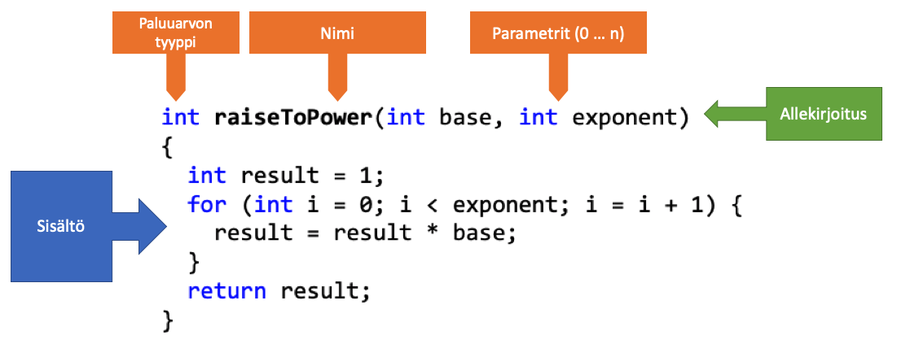

# Osa 3 - Funktiot

Tähän asti olemme käsitelleet ohjelmia, joissa on joko peräkkäisuorittamista tai ohjausrakenteita. Jotta voisimme oikeasti tehdä ohjelmia joista on hyötyä, tarvitsemme rakenteita joiden avulla meidän ei tarvitse toistaa samaa koodia. C++:ssan standardikirjastosta löytyy laaja joukko funktiota, mutta valtaosan käyttämistäsi funktioista kirjoitat itse tai lainaat muilta.

## Esimerkki funktioista

Kuvitellaan seurava esimerkki, haluamme laskea 3 potenssiin 3 (3^4), voisimme toteuttaa sen seuraavasti.

```c++
int tulos = 1;

 for (int i = 0; i < 4; i = i + 1) 
 {
    tulos = tulos * 3;
 }

 cout << "3^4 = " << tulos << endl;

``` 

Jos seuraavaksi haluaisimme laske 6 potenssiin 5, (6^5), toteuttaisimme seuraavan.
```c++
int tulos = 1;

 for (int i = 0; i < 5; i = i + 1) 
 {
    tulos = tulos * 6;
 }

 cout << "6^5 = " << tulos << endl;

``` 

Käyttäisimem näin ollen lähes samaa koodia kahteen kertaa, tätä kutsutaan copy-paste koodaamiseksi. Ja lopputulos copy-paste koodaamisessa on ennen pitkää ongelmat koodin laadussa. Kun koodia kopioidaan siitä tulee vaikealukuista sekä mahdolliset virheet kertautuvat.

Jotta voisimme uudelleenkäyttää kirjoitetua koodia, voimme kerätä lausekkeita omiksi kokonaisuuksiksiin, **funktioiksi**. Jotta funktioista on hyötyä niiden suunnitteluun kannattaa käyttää aikaa.

Voisimme toteuttaa potenssiin korotouksen esimerkiksi seuraavasti.

```c++
int main() {
 int tulos = raiseToPower(3, 4);
 cout << "3^4 = " << tulos << endl;
 return 0;
} 
````

Tässä toteutuksessa **raiseToPower** on funktio, jolle välitetään arvot 3 ja 4, funktio palauttaa jonkin int-tyypisen arvon. 

C++-funktiolla on ominaisuudet:
- Paluuarvo
- Parameterit
- Nimi

Kun olemme toteuttaneet potenssiin korotus funktion, voimme käyttää sitä useaan kertaan eri parametreilla.

```c++
int main() 
{
    int tulos = raiseToPower(3, 4);
    cout << "3^4 = " << tulos << endl;
    tulos = raiseToPower(6, 5);
    cout << "6^5 = " << tulos << endl;
    return 0;
} 

```

## Miksi funktiot?

Edellisen kappaleen esimerkin mukaisesti funktiot ovat siis kokoelma lausekkeita, jotka suoritetaan peräkkäin. Kuitenkaan tämä määritelmä ei tarkasti kerro miksi funktiot ovat hyödyllisiä, parempi kuvaus voisi olla: "Funktio on uudelleenkäytettävä kokoelma peräkkäin suoritettavia lausekkeita tietyn tehtävän suorittamiseksi" **-> Tärkeää on nimenomaan se, että funktio suorittaa itsenäisesti tietyn tehtävän.**

Funktion käyttötarkoitus (eli milloin tulisi tehdä funktio):
- Ohjelman yksinkertaistaminen, oikein toteutettu ja toimivaksi testattu funktio auttaa keskittymään kehitteillä olevaan koodiin.

- Toiston välttäminen

- Koodin uudelleen käyttö

- Ylläpidettävyys, jos funktiossa on vika tai sitä halutaan parentaa tarvitsee muuttaa vain sisältö funktiossa ei useita kohtia koodissa. Tämän vuoksi funktion tulisi olla myös itsenäinen.

- Luottavuuden parantaminen, ulkopuolinen lukija ymmärtää paremmin funktiokutsun esim. raiseToPower(), kuin algoritmin

- Optimointi, funktiota on helpompi optimoida kuin pientä osaa koodia isomman osan sisällä.


## Funktion rakenne

C++:ssa funktio rakentuu seuraavasti, funktion rakennetta kutsutaan **määrittelyksi**




Esimerkissä **raiseToPower** on funktio, jolla on ominaisuudet:
- Paluuarvon tyyppi (int)
- Parameterit (int base ja int exponent)
- Nimi (raiseToPower)
- Sisältö (4 lauseketta)
- Allekirjoitus (funktion paluuarvo+nimi+parametrit)

### Allekirjoitus

Jokaiselle funktiolle määrittyy kääntäjän toimesta oma allekirjoitus (funktion paluuarvo+nimi+parametrit), allekirjoituksen avulla tiedetään mitä funktiota ollaan kutsumassa. Saman näkyvyysalueen (nimiavaruus, luokka) sisällä ei voi olla kahta saman allekirjoituksen omaavaa funktiota.

### Paluuarvo

C++:ssa funktio voi palauttaa joko yhden arvon, tai ei mitään (void). Paaluuarvon tyyppi määritellään funktion allekirjoitukseen. Jos funktio palauttaa arvon sen tulee olla sama kuin määritetty paluuarvon tyyppi.

```c++
//Seuraava ei ole kelvollinen
int palautaLuku()
{
    return "hello"; // VIRHE, väärä paluuarvo
} 

//Tämä toimii
int palautaLuku()
{
    return 0;
} 


//Jos funktio ei palauta arvo return lausetta ei tarvita
void sanoHei() //paluuarvona void
{
    cout << "HEI" << endl;
} 

void sanoHei(int kertaa) //paluuarvona void
{
    if(kertaa == 0)
        return; //funktiosta voidaan poistua return lauseella milloin vain

    for(int i = 0; i < kertaa; i++)   
        cout << "HEI" << endl;
} 
```

Huomaa, että return lausetta käytetään arvon palauttamiseen, mutta se myös lopettaa funktion suorittamisen. Näin ollen esim. if-lauseen eri haaroista voidaan poistua eri arvoilla.

```c++
bool onkoParillinen(int luku)
{
    if(luku % 2== 0)
        return true;
    else
        return false;
} 
```

### Parametrit
Funktiolle voidaan välittää joko useita parametreja tai se voi olla parametritön. Jos funktio on parametritön funktion nimen jälkeen tulee vain () -sulkeet

```c++
void sanoHei()
{
    cout << "HEI" << endl;
} 
```

Kun funktiolla on yksi tai usempi parametri listataan ne peräkkäin ja jokaiselle parametrille annetaan tietotyyppi sekä parametrin nimi. Parametrejä käytetään funktion sisällä kuin ne olisivat normaaleita muuttujia.

Esimerkissämme raiseToPower -funktio ottaa vastaan kaksi paramaterit base ja exponent ja niitä käytetään funktion sisällä muuttujina.

```c++

int raiseToPower(int base, int exponent) 
{
    int result = 1;
    for (int i = 0; i < exponent; i = i + 1) 
    {
        result = result * base;
    }
    return result;
}

```

### Kutsuminen

Funktiota kutsutaan sen nimen mukaisesti, kutsuun annetaan parametrit (oikeilla tietotyypeillä). Jos annetaan väärät parametrit tai väärä määrä parameterejä antaa kääntäjä virheen.

```c++

int raiseToPower(int base, int exponent) 
{
    int result = 1;
    for (int i = 0; i < exponent; i = i + 1) 
    {
        result = result * base;
    }
    return result;
}

int main() 
{
    //TOIMII
    int tulos = raiseToPower(3, 4);

    //EI TOIMII
    tulos = raiseToPower();

    //EI TOIMII
    tulos = raiseToPower(2);

    //EI TOIMII
    tulos = raiseToPower("HEI");
} 
```

### Ylimäärittely

Funktioita on mahdollista ylimääritellä, tämä tarkoittaa sitä, että samannimisellä funktiolla on monta eri toteutusta. Toteutusten tulee vaihdella joko paluuarvon mukaan tai parameterien mukaan. Näin funktiolle muodostuu yksilöllinen allekirjoitus ja kääntäjä osaa linkitää funktiokutsun oikeaan toteutukseen.

``` c++
void tulosta(int x)
{
    cout << "Kokokonaisluku: " << x << endl;
}
void tulosta(float x)
{
    cout << "Liukuluku: " << x << endl;
} 
void tulosta(int x, int y)
{
    cout << "Kokonaisluvut: " << x << " ja y:" << y << endl;
}
```

### Esittely

Tähän mennessä olemme määritelleet funktioita, tämä toimii jos funktio määritellään ennen sen kutsumista. Eli seuraavasti.

```c++
//Määrittely main()-funktion yläpuolella/ennen joten kääntäjä tuntee funktion jo main-kohdassa
int raiseToPower(int base, int exponent) 
{
    int result = 1;
    for (int i = 0; i < exponent; i = i + 1) {
        result = result * base;
 
    }
    return result;
}

int main() 
{
    int tulos = raiseToPower(3, 4);
    cout << "3^4 = " << tulos << endl;
    return 0;
} 
```
Näin kääntäjä tuntee funktion ennenkuin sitä käytetään, tämä on kuitenkin pitkän päälle kestämätön tapa toteuttaa funktiota ja estää modulaarisen kehittämisen. Parempi (oikea) tapa on aluksi esitellä funktion prototyypit kääntäjälle, jotta kääntäjä tietää funktio määrittelyn tulevat myöhemmin.

Prototyypit voidaan esitellä joko lähdekooditiedostossa tai erillisessä .h tiedostossa. Prototyypin määrittely sisältää funktion allekirjoituksen ja loppuu puolipilkkuun. 


``` c++

//Funktion esittely / prototyyppi
int raiseToPower(int base, int exponent);

int main() 
{
    //Funktion käyttäminen
    int tulos = raiseToPower(3, 4);
    cout << "3^4 = " << tulos << endl;
    return 0;
} 

//Funktion määrittely
int raiseToPower(int base, int exponent) 
{
    int result = 1;
    for (int i = 0; i < exponent; i = i + 1) {
        result = result * base;
 
    }
    return result;
}

```

### Parametrien oletusarvot

Funktion parametreille on mahdollista asettaa oletusarvo, näin ollen jos kutsutaan funktiota ilman parametrien arvoja saavat ne oletusarvot. Jos yhdelle paramaterille annetaan oletusarvo kaikille tämän parametrin jälkeen tuleville parametreille tulee asettaa oletusarvo.

Jos halutaan antaa oletusarvo se annetaan joko vain esittelyssä tai jos funktio suoraan määritellään niin määrittelyn yhteydessä.

```c++
//Funktio jonka parametrilla on oletus arvo
int tulostaNKertaa(string teksti, int kertaa = 1)
{
    for ( int i = 0; i < n ; ++ i ) 
    {

        cout << teksti ;

   }
}

int main() 
{
    //Jos funktiota kutsutaan ilman viimeistä parametria saa tämä parametri arvon 1
    tulostaNKertaa("Hei");
    return 0;
}

//Seuraava esittely taas ei ole toimiva, koska y ja z eivät saa oletusarvoja
int tulostaXYZ(int x = 0, int y, int z)
```

### Arvot viitteinä

Jos funktiot toteutetaan kuten edellä funktioden parametreihin kopioidaan arvot sitä kutsuttaessa. Näin funktiossa on käytössä erii muuttujat (eri muistiosoitteet) kuin kutsuvassa koodissa. Tätä toimintamallia kutsutaan arvoina välittämiseksi (Pass by value). On kuitenkin mahdollista toteuttaa funktio niin, että sille välitetään viittaukset muuttujiin, tällöin funktio voi muuttaa parametrien arvoja ja muutos välittyy takaisin kutsuvalle ohjelmalle. Tämä toimintamalli on englanninkieliseltä nimeltä Pass by reference.

Yksinkertainen esimerkki arvoina välittämisestä voisi olla.

```c++
// pass-by-value
void increment(int a)
{
    a = a + 1;
    cout << "a arvo funktiossa (a+1): " << a << endl;
}

int main()
 {
    int q = 3;
    increment(q); // ei muuta q:ta
    cout << "q kutsun jälkeen: " << q << endl;
} 
```

Arvona välittämistä voidaan havainnollistaa seuraavasti.


Jos halutaan muuttaa muuttujan välitettyä muuttujaa funktiossa käytetään parametrina viittausta. Viittaus toimii niin, että se sisältää muuttujan muistipaikan osoitteen arvon (ei muuttujan arvoa). Näin voidaan muokata suoraan kyseistä muistipaikkaa ja sen sisältöä.

Kun luomme muuttujan sille varataan muuttujan koon mukaisesti tila muistista, tätä on haivainnollisestettu seuraavassa kuvassa. Muuttujalla on siis arvo ja muistipaikan osoite.


Voimme saada viittauksen muuttujan muistipaikkaan &-operaattorilla. Nyt &a kertoo muistipaikan 0x12345670 osoitteen.


Tätä voidaan testata seuraavasti.
```c++
int main()
{
    int a = 3;
    std::cout << "a: " << a << ", sen muistipaikka:" << &a << std::endl;
}

```
**!HUOM Viittaus pitää aina alustaa, eikä viittauksen kohdetta voi vaihtaa**

Viittausten hyödyntäminen funktiosssa tapahtuu seuraavasti. Funktion määritelyssä vain esitellään muuttuja a viittauksena, muuten muuttujaa käytetään normaalista. 

```c++
// pass-by-reference
void increment(int &a)
{
    a = a + 1;
    cout << "a arvo funktiossa (a+1): " << a << endl;
}

int main()
 {
    int q = 3;
    increment(q); // q muuttuua funktiossa, koska funtkio käsittelee muistiosoitetta
    cout << "q kutsun jälkeen: " << q << endl;
} 
```

### Arvojen vakiointi

Jos halutaan olla varmoj,a että funktiossa ei muuteta muuttujan arvoa, hyödyllistä referenssinä välitettävien arvojen kanssa, voidaan määritellä **const** muuttujan eteen. Näin ei vahigossa muuteta tai käytetä funktiolle välitettyjä paremetrejä, vaan kääntäjä huomaa virheen.

Tästä on etuja esim. jos halutaan välittää isoja lukuja funktiolle ilman kopiointia joka syö muistia.

```c++
void print ( const long &x ) //const varmistaa että x ei muutu
{ 
    cout << x ;

    //Tämä antaisi virheen kääntäjässä
    // x = 0;
}

int main ()
{
    long x = 234923592;
    print ( x ); /
    return 0;
}
```

#### Erillinen .h tiedosto ja .cpp tiedosto

**Nimiavaruudet**

Funktiot voidaan erotella omiksi .h (otsikko) ja .cpp (lähdekooditiedostoiksi), näin niitä on helpompi siirtää eri projektien välillä. Tämä luo perusteet omien kirjastojen kirjoittamiselle.

Funktioita (ja myöhemmin luokkia) voi ja kannattaa kasata nimiavaruksiksi (namespace). Nimiavaruudet ovat tavallaan kokoelmia, jotka sisältävät funktiota sekä muuttujia. Olemme tähän mennessä käyttäneet std-nimikokoelman cout ja cin funktiota. Nimiavaruuksien tehtävä on paloitella ohjelmaa kokonaisuuksiin, sekä estää samannimisten funktioiden sekoittumista. C++:n standardikirjasto on std-nimiavaruuden sisällä.

Nimiavaruuteen viitataan aina kertomalla **nimiavaruuden_nimi : muuttuja/funktio** 

Jos halutaan kertoa käyttäjälle, että koodissa käytetään jonkin nimiavaruuden muuttujia / funktiota käytetään komentoa: 

**using namespace nimiavaruus**

Näin kääntäjä tietää hakea tietoja tästä nimiavaruudesta. Tällöin pitää muistaa, että jos käyttää using-lausetta usealle nimiavaruudelle, jotka sisältävät samanimisiä muuttujia/funktiota menee kääntäjä sekaisin. 

Luodaan seuraavaksi oma nimiavaruus "matematiikka" joka sisältää muuttaman matemaattisen funktion omissa .h ja .cpp tiedostoissa.

Valitse Qt-Creatorissa:
1. "File -> New File or Project -> C++ Header File"
2. Anna nimeksi matikka.h

Tämä luo uuden otsikkotiedoston jonne luomme funktioiden esittelyt. Tyhjä otsikkotiedosto näyttää seuraavalta

```c++
#ifndef MATIKKA_H
#define MATIKKA_H

#endif // MATIKKA_H

```

Tässä tiedostossa on muutama uusi asia:
- #ifndef MATIKKA_H kysyy kääntäjältä tunteeko se MATIKKA_H määritykset, jossei kääntäjä tunne määritystä jatketaan #ifndef lohkon käsittelyä, lohko päättyy #endif lauseeseen. #ifndef Lohkossa määritellään kääntäjälle MATIKKA_H arvo #define-kommennola. Näin kääntäjä ei käsittele #ifndef lohkon sisältöä useaan kertaan vaikka .h tiedostoa käytettäisiin useasti. Jos tätä #ifndef - #endif rakennetta ei olisi .h tiedosssa, olisi mahdollista että .h käsitellään useaan kertaan ja kääntäjälle esiteltäisiin samat funktiot useaan kertaan. Tämä aiheuttaisi virheen.

Kirjoita matikka.h sisältö seuraavasti:
```c++
#ifndef MATIKKA_H //jos MATIKKA_H ei ole määritelty niin käännä tämä lohko
#define MATIKKA_H

namespace matikka
{
    int korotaPotenssiin(int arvo, int potenssi = 1);
}
#endif // MATIKKA_H lohko loppuu
```

Tässä luomme oman matikka nimiavaruuden sekä yhden funktion potenssiin korottamiselle.

Luo vastavasti uusi lähdekooditiedosto:
1. "File -> New File or Project -> C++ Source File"
2. Anna nimeksi matikka.cpp

Lähdekooditiedoston alussa tulee kerto missä otsikkotiedostossa funktioiden esittely sijaitsevat, tämän jälkeen voimme määritellä funktion. Huomaa, kun funktio kuuluu nimiavaruuteen tulee nimiavaruuden nimi sisällyttää funktion nimen eteen.

!HUOM kun sisällytämme otsikkotiedostoja on kaksi vaihtoehtoa:
- "tiedosto.h" -> etsii otsikkotiedostoa ns. user include paikoista, eli yleensä projektin /include hakemistosta
- "<tiedosto.h>" etsii otsikkotiedosto ns. system include paikoista, eli järjestelmän ja IDE:n määrittelemistä hakemistoista. Esim. kaikki standardikirjaston otsikkotiedostot löytyvät näin-

matikka.cpp tiedoston sisältö on siis seuraava.

```c++
#include "matikka.h"

int matikka::korotaPotenssiin(int arvo, int potenssi)
{
    int result = 1;
    for (int i = 0; i < potenssi; i = i + 1)
    {
        result = result * arvo;

    }
    return result;
}

```

Oman korotaPotenssiin käyttäminen tapahtuu seuraavasti.

```c++
#include <iostream>
#include "matikka.h"

using namespace std;
using namespace matikka;

int main()
{
    cout <<  korotaPotenssiin(10,2) << endl;
    return 0;
}

```

Lopuksi voisimme toteuttaa funktion joka laskee luvulle neliön, käyttäen viittausta.

```c++

//matikka.h
#ifndef MATIKKA_H
#define MATIKKA_H

namespace matikka
{
    int korotaPotenssiin(int arvo, int potenssi = 1);
    void nelio(int& luku);
}
#endif // MATIKKA_H


//matikka.cpp
#include "matikka.h"

int matikka::korotaPotenssiin(int arvo, int potenssi)
{
    int result = 1;
    for (int i = 0; i < potenssi; i = i + 1)
    {
        result = result * arvo;

    }
    return result;
}

void matikka::nelio(int& luku)
{
    luku *= luku;
}


//main.cpp
#include <iostream>
#include "matikka.h"

using namespace std;
using namespace matikka;

int main()
{
    cout <<  korotaPotenssiin(10,2) << endl;

    int arvo = 2;
    nelio(arvo);
    cout <<  arvo << endl;

    return 0;
}

```