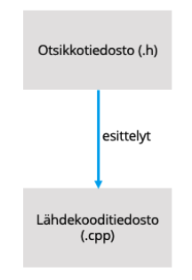
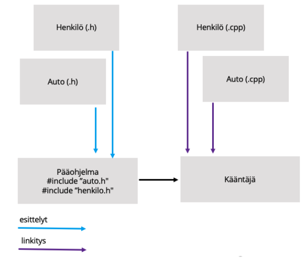
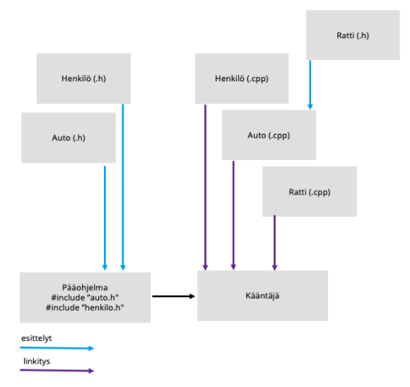
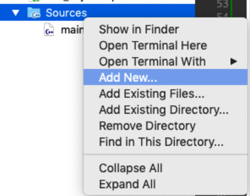
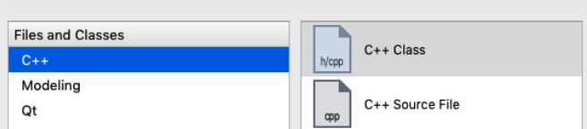
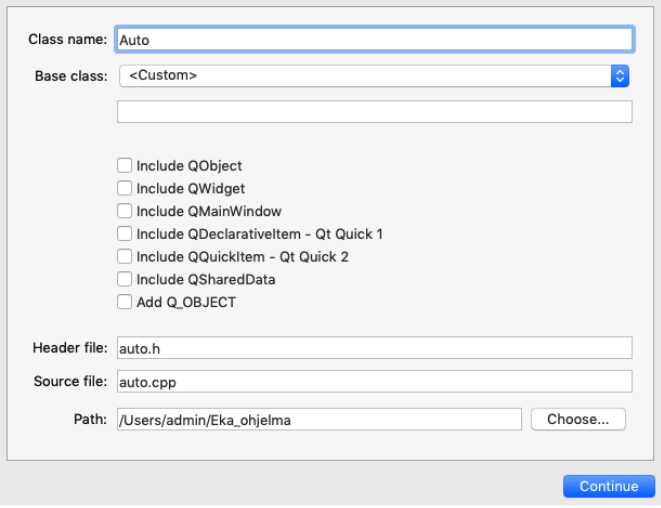
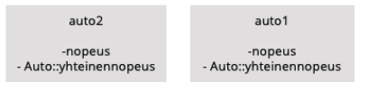

# Luokat omissa tiedostoissa

## Johdanto

Kurssilla on tähän mennessä käyty läpi koodin kirjoittamista yhteen tiedostoon, käyttäen funktioita ja luokkia.. Kuitenkin jo yksinkertaisen esimerkkimme ja tehtävien avulla huomaamme, että tämä ei ole jatkuvuuden, ylläpidon tai ylipäätään yleisen projektin hallinnan kannalta järkevä tapa. 

Olemme käyttäneet tähän mennessä myös muiden kehittämiä, ja C++:n standardijakeluun kuuluvia otsikkotiedostoja ().h). Kuitenkin ohjelmamme kasvaessa tarvitsemme omia otsikkotiedostoja ja koodin jakamista tiedostoihin.  

## Otsikko- ja lähdekooditiedostot

Koodi voidaan jakaa C++:ssa, seuraavasti:

- Otsikkotiedostot (header-files, .h) sisältävät funktioiden esittelyt, luokat sekä muuttujat 

- Lähdekooditiedostot (source-files, .cpp) sisältävät määrittelyt edellisille 


Jakaminen otsikkoihin ja lähdekoodiin on esitetty seuraavassa kuvassa.


Ohjelmaa käännettäessä kääntäjä lukee aluksi sisään ne lähdekooditiedostot, jotka ohjelmoija kääntäjälle lähettää. Lähettäminen tehdään usein IDEn toimesta, mutta joskus ohjelmoijan tulee hallita tätä itse (mm. Makefilen avulla). Näissä lähdekooditiedostoissa (kuten main.cpp) on lueteltuna ne otsikkotiedostot, joiden esittelyitä lähdekooditiedosto tarvitsee. Näin kerrotaan kääntäjälle, että seuraavat funktiot / oliot ovat käytettävissä. Seuraavassa vaiheessa kun kääntäjä luo lähdekoodista koodikieliset versiot se linkittää otsikkotiedoston viitteet oikeisiin kohtiin koodikielisessä versiossa. 




On myös mahdollista, kirjoittaessa omia lähdekooditiedostoja (.cpp), kertoa lähdekooditiedostossa, että tämä tiedosto käyttää funktio/luokkaa, joka on määritelty toisessa tiedostossa (.h). Näin kaikkia otsikkotiedostoja ei tarvitse kasata pääohjelmaan (main.cpp). Tätä on havainnollistettu seuraavassa: 


Nyt auto.cpp käyttää ratti.h tiedostoa.

## Luokkien toteuttaminen .h ja .cpp -tiedostoissa

C++:ssa luokan määrittely kannattaa tehdä omaan .h tiedostoon. Esim. Auto-luokan määrittely tehdään auto.h tiedostoon. Ja itse funktiot, jotka luokka toteuttaa tulevat auto.cpp -tiedostoon. 

Qt-Creatorissa luokan tekeminen on helppoa. Kun luokka tehdään IDEn UI:n kautta ei koodarin tarvitse huolehtia kääntäjän manuaalisesta konfiguroinnista. Tee uusi luokka seuraavasti: Klikkaa oikealla napilla projektin kansiota ja valitse **”Add new…”**  



Seuraavasta ikkunasta valitse **C++ luokka**:


Kirjoita seuraavaksi luokan nimi ja valitse **”Continue”** ja seuraavasta ikkunasta **”Done”**:


Nyt Qt-Creator on luonnut luokan rungon valmiiksi, ja jakanut luokan määrittelyt .h tiedostoon sekä alustanut .cpp tiedoston.  

Otsikkotiedostoon .h on tehty seuraavat määritykset:

```c++
#ifndef AUTO_H
#define AUTO_H


class Auto
{
public:
    Auto();
};

#endif // AUTO_H

```

**#ifndef** rivi kertoo kääntäjälle, että jos AUTO_H määritettä ei ole esitelty kääntäjälle, jatketaan seuraavien rivien käsittelyä. Jos AUTO_H on esitelty kääntäjälle tiedoston käsittely lopetetaan. Tämän tarkoituksena on estää luokan määrittely useamaan kertaan. Jos luokka määriteltäisiin useasti kääntäjälle, kääntäjä ei tietäisi mikä määrittely on oikea. Tämä rivi on oleellinen, jos otsikkotiedostoa käytetään useassa lähdekooditiedostossa. 


**#define** rivi määrittelee kääntäjälle AUTO_H määritteen, tämän jälkeen kääntäjällä on AUTO_H määrite tiedossa. vrt. edellinen rivi.

**class Auto** rivi kertoo kääntäjälle, että tästä alkaa Auto-luokan määrittely, seuraavalla riville tulee kaarisulke { joka aloittaa varsinaisen määrittelyn, huomaa että määrittely loppuu kaarisulku ja ; yhdistelmään };. 

Seuraavaksi tutustumme itse luokan lähdekoodiin Qt-Creatorin luoma toteutus (auto.cpp) näyttää tältä: 

```c++
#include "auto.h"

Auto::Auto()
{

}

```

Tässä on aluksi kerrottu kääntäjälle, että tämä luokka on määritelty ”auto.h” -tiedostossa. 


Tämän jälkeen määritellään Auto() rakentajan sisältö, huomaa että rakentaja (kuten ei myöskään hävittäjä) palauta mitään arvoa.  

Funktion määrittely luokan tapauksessa sisältää aluksi luokannimen, johon funktio kuuluu, eli Auto sen jälkeen tulee :: pisteet sekä funktion nimi Auto(). Jos funktiolla on paluuarvo se tulee ensimmäisenä ja parametrit kuten normaalisti funktioita määriteltäessä. 

## Omien funktioiden määrittely luokkaan

Luodaan seuraavaksi muutamia, muuttujia Auto-luokkaamme sekä funktioita. Hyödynnämme tässä tiedon piilotusta, käyttämällä julkisia sekä yksityisiä suojamääreitä.

Annetaan Auto-luokalle jäsenmuuttujat, nopeus sekä tunniste. Nämä jäsenmuuttujat ovat yksityisiä.
Sekä lisäksi näihin jäsenmuuttujiin liittyvät funktiot, joilla asetetaan tai noudetaan jäsenmuuttujien arvot. Edellä mainittujen lisäksi lisäämme uuden konstruktorin jolle voi antaa parametrina tunnisteen.

```c++
class Auto
{
public:
    Auto();
     Auto(long tunniste);
       
    void setNopeus(int n);
    void setTunniste(long t);
    
private:
    int nopeus;
    long tunniste;
    
};

```

Seuraavaksi toteutamme vastaavat funktiot Auto.cpp tiedostoon. Tunnisteen luomisessa käytämme random-funktiota.

```c++
#include "auto.h"

#include <stdlib.h>
#include <time.h>
#include <stdio.h>

Auto::Auto()
{
    srand( (unsigned)time(NULL) );
    tunniste  = rand();
}

Auto::Auto(long tunniste)
{

    this->tunniste  = tunniste;
}

void Auto::setNopeus(int n)
{
    this->nopeus = n;
}

void Auto::setTunniste(long t)
{
    this->tunniste = t;
}

int Auto::getNopeus()
{
    return nopeus;
}

long Auto::getTunniste()
{
    return  tunniste;
}

```

Oheisen määritysten jälkeen voimme käyttää Auto-luokkaa pääohjelmassamme.

```c++
#include <iostream>

#include "auto.h"

using namespace std;

int main()
{
    Auto a1 = Auto();
    Auto a2 = Auto(1202);

    a1.setNopeus(10);
    a2.setNopeus(20);

    cout << "Auto1 nopeus:" << a1.getNopeus() << " tunniste:" << a1.getTunniste() << endl;
    cout << "Auto2 nopeus:" << a2.getNopeus() << " tunniste:" << a2.getTunniste() << endl;
    return 0;
}

```

## Staattiset muuttujat

Oletuksena luokkien jäsenet ovat niiden olioiden omia, jotka luokista on muodostettu. Esimerkiksi jos meillä on luokka Auto ja luokassa jäsenmuuttuja nopeus, luokasta muodostetuilla oliolla auto1 ja auto2 on omat nopeusmuuttujansa. 


Kuitenkin on mahdollista käyttää luokassa jaettua/staattista muuttujaa, joka on yhteinen kaikille luokasta muodostetuille olioille. Tätä voisi havainnollistaa seuraavasti: 



Näitä luokkien yhteisiä jäsenmuuttujia kutsutaan staattisiksi (static) muuttujiksi, ja ne merkitään sanalla static. Staattiset jäsenmuuttujat esitellään luokan sisällä, mutta ne täytyy myös määritellä, jotta niitä voidaan käyttää. Nämä staattiset muuttujat ovat ”elossa” koko ohjelman suorittamisen ajan alusta loppuun riippumatta siitä, luodaanko luokasta yhtään oliota.  

Jos haluamme esimerkiksi seurata kuinka monta Auto-luokasta tehtyä oliota meillä on voimme tehdä Auto-luokkaan staattisen muuttujan, jonka arvoa kasvatetaan rakentaja funktiossa. Koska rakentajaa kutsutaan aina kun uusi olio luodaan kasvaa myös muuttujamme arvo.

Seuraavassa on esitetty miten tehtyjen autojen määrää voidaan laskea: 

Auto.h

```c++
#ifndef AUTO_H
#define AUTO_H


class Auto
{
public:
    Auto();
     Auto(long tunniste);

    void setNopeus(int n);
    void setTunniste(long t);

    int getNopeus();
    long getTunniste();

    //Staattisen muuttujat:
public:
    static int tehdytAutot;

private:
    int nopeus;
    long tunniste;

};

#endif // AUTO_H

```

Auto.cpp

```c++
#include <time.h>
#include <stdio.h>

//Määritellään staattinen muuttuja
int Auto::tehdytAutot = 0;


Auto::Auto()
{
    srand( (unsigned)time(NULL) );
    tunniste  = rand();
    tehdytAutot++;
}

Auto::Auto(long tunniste)
{
    this->tunniste  = tunniste;
    tehdytAutot++;
}

void Auto::setNopeus(int n)
{
    this->nopeus = n;
}

void Auto::setTunniste(long t)
{
    this->tunniste = t;
}

int Auto::getNopeus()
{
    return nopeus;
}

long Auto::getTunniste()
{
    return  tunniste;
}


```

main.cpp

```c++
#include <iostream>

#include "auto.h"

using namespace std;

int main()
{
    Auto a1 = Auto();
    Auto a2 = Auto(1202);

    a1.setNopeus(10);
    a2.setNopeus(20);

    cout << "Auto1 nopeus:" << a1.getNopeus() << " tunniste:" << a1.getTunniste() << endl;
    cout << "Auto2 nopeus:" << a2.getNopeus() << " tunniste:" << a2.getTunniste() << endl;

    cout << "Tehdyt autot:" << Auto::tehdytAutot << endl;
    return 0;
}

```

## Staattiset funktiot

Staattinen funktio on funktio, joka toimii ilman luokasta tehtyä oliota. Nämä funktiot voivat käsitellä vain staattisia jäsenmuuttujia, tai tehdä toteuttaa komentoja joihin ei tarvita olion jäsenmuuttujia. Tälläisia funktioita voivat olla esim. Matematiikka luokan operaatiot.

Auto luokan osalta staattinen funktio voisi olla esim. kuvaile.

Staattinen funktio esitellään:

```c++
 static void kuvaile();
```

ja määritellään:
```c++
void Auto::kuvaile()
{
    cout << "Autossa on neljä rengasta" << endl;
}
```
sekä lopuksi käytetään:

```c++
Auto::kuvaile();
```

Tämän osion lähdekoodit löytyvät:

auto.h: https://github.com/centria/cpp-ohjelmointi-harjoitukset/blob/master/osa6_auto.h
auto.cpp: https://github.com/centria/cpp-ohjelmointi-harjoitukset/blob/master/osa6_auto.cpp
main.cpp: https://github.com/centria/cpp-ohjelmointi-harjoitukset/blob/master/osa6_main.cpp
