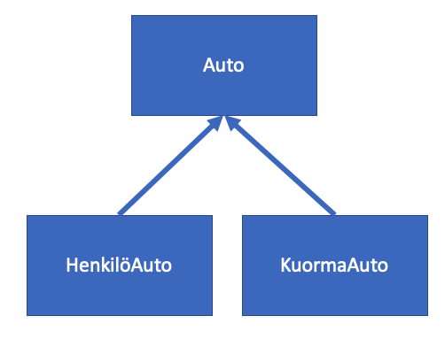

# Perintä

Perintä on olio-ohjelmoinnin periaata, jonka avulla voimme luoda hierarkian luokkien välille. 
Hierarkiasta on hyötyä kun luomme kokonaisuuksia jotka jakavat osittain samoja ominaisuuksia, esimerkiksi HenkiloAuto ja Kuorma-auto luokilla on paljon samoja ominaisuuksia, mutta myös paljon eroavaisuuksia.
Perinnän avulla meidän ei tarvitse kopioida koodia.

Olio-ohjelmoinnissa voimme toteuttaa yhteisen Auto-luokan joka toteuttaa yhteiset ominaisuudet, HenkilöAuto ja KuormaAuto luokat voivat periä nämä ominaisuudet ja toteuttaa lisäksi omat erilliset omnaisuudet. Auto-luokkaa kutsutaan tällöin isäntä -luokaksi (parent/base) ja HenkilöAuto/KuormaAuto ovat perittyjä luokka (derived)

Käytämme seuraavaksi "Luokat omissa tiedostoissa" osiossa tehtyä Auto-luokkaa ja perimme siitä uudet luoka HenkiloAuto ja KuormaAuto.

Perityt luokat voivat käyttää kaikkia jäsenmuuttujia ja funktioita, jotka ovat määriteltynä isäntäluokassa public tai procted näkyvyydelle. Private näkyvyyden omaavat jäsenet kuuluvat vain ne omistavalle luokalle.

1. Lisää uusi luokka projektiin nimelta **HenkiloAuto**.

2. Kun haluamme periä Auto -luokan ominaisuudet HenkiloAuto luokkaan toteutamme seuraavan koodi

HenkiloAuto.h

```c++
#ifndef HENKILOAUTO_H
#define HENKILOAUTO_H

#include "auto.h"

//Peritään Auto luokka, HUOM! yllä aluksi pitää tehdä #include auto.h jotta tunnemme Auto-luokan
class HenkiloAuto: public Auto
{
public:
    HenkiloAuto();
};

#endif // HENKILOAUTO_H
```

henkiloauto.cpp

``` c++
#include "henkiloauto.h"

//Konstruktotin jälkeen, voimme kutsua isäntäluoka konstruktoria
// tämä tahtuu ":isäntäluokan_konstruktori() syntaksille
// Parametritonta isäntäluoka konstruktoria kutsutaan automaattisesti
HenkiloAuto::HenkiloAuto(): Auto()
{

    
    
}

```

Huomaa, että kun perimme luokan meidän tulee kutsua myös isäntäluokan rakentajaa luokkamme rakentajassa. Parametrittomissa rakentajissa toiminta on toisin automaattinen, mutta esitetty yllä esimerkiksi. Tuhoajassa tämä tapahtuu automaattisesti, eli isäntäluokan tuhoajaa kutsutaan aina. 

Nyt HenkiloAuto luokalla on kaikki samat ominaisuudet kuin Auto-luokalla

3. Samalla tapaa toteutetaan KuormaAuto -luokka.

Nyt olemme toteuttaneet seuraavan mallin.




## On ja Omistaa suhteet

Luokkan suhdetta muihin luokkiin voidaan kuvata kahdella määritteellä:
1. Jokaiselle oliolla A on **(omistaa)** olio B. Esimerkiksi jokaisella Autolla on nopeus.

2. Jokainen olio A **on** olio B. Esimerkiksi jokainen HenkilöAuto on Auto

Perintää käytetässä on tärkeää luoda on suhteita, mutta ei omistaa suhteita. Jos yritämme periä oliota väärästä luokasta olemme suunnitelleet toteutuksemme väärin. 


## Funktioiden ylimäärittely

Kun perimme isäntäluokasta uuden luokan, sen funktiot tulevat edellä määritellysti käyttöön perityssä luokassa. Voimme kuitenkin toteuttaa perityssä luokassa saman nimisen funktion, jolloin se korvaa isäntäluokan funktion. Esim. KuormaAuto-luokassa voimme määritellä setNopeus() funktion niin että KuormaAuto ei voi ajaa yli 80 km/h (lain mukaan).

```c++
class KuormaAuto: public Auto
{
public:
    KuormaAuto();
    
    void setNopeus(int n);
};
```

```c++
void KuormaAuto::setNopeus(int n)
{
    
    //Kutsutaan isäntäluokan setNopeus()
    Auto::setNopeus(n);
    
    if(getNopeus() > 80)
        Auto::setNopeus(80);
    
}

```

Huomaat nyt että olemme määritelleet Auto -luokassa nopeus muuttujat private suojamääreellä, näin emme voi suoraan käyttää sitä perityssä luokassa vaan rajapintojen kautta.

## protected -suojamääre

Kun olemme määritellet nopeus ja tunniste muuttujat yksityisen suojamääreen taakse (private), eivät edes perityt luokat voi käyttää näitä jäsenmuuttujia suoraan. Jos haluamme käyttää näitä jäsenmuuttujia perityissä luokissa tulee niiden olla protected suojamääreen takana. Näin ne eivät näy ulkopuolisille käyttäjille. Toteuta muutos Auto.h luokkaan korvaamalla "private:" -> "protected:"

Näin voimme KuormaAuto -luokassa näyttää nopeus jäsenmuuttujaa suoraan.

```c++
void KuormaAuto::setNopeus(int n)
{
    nopeus = n;
    
    if(nopeus > 80)
        nopeus = 80;
}

```

Lopuksi käytämme HenkiloAuto ja KuormaAuto luokkia pääohjelmassamme.

```c++
#include <iostream>

#include "henkiloauto.h"
#include "kuormaauto.h"
using namespace std;

int main()
{
    Auto::kuvaile();

    HenkiloAuto a1 = HenkiloAuto();
    KuormaAuto a2 = KuormaAuto();

    a1.setNopeus(10);
    a2.setNopeus(20);

    cout << "Auto1 nopeus:" << a1.getNopeus() << " tunniste:" << a1.getTunniste() << endl;
    cout << "Auto2 nopeus:" << a2.getNopeus() << " tunniste:" << a2.getTunniste() << endl;

    cout << "Tehdyt autot:" << Auto::tehdytAutot << endl;
    return 0;
}

```

Ylläolevan esimerkin koko koodi löytyy linkistä:
https://github.com/centria/cpp-ohjelmointi-harjoitukset/tree/master/perinta

## Moniperintä

C++:ssa luokka voi periä yhden tai useamman luokan, tätä kutsutaan moniperinnäksi. Kun luokka periytyy monesta luokasta perii se näiden luokkien jäsenmuuttujat ja funktiot itselleen.

Moninperintä on esitetty seuraavassa erillisenä esimerkkinä. Tässä luokka C perii A:n ja B:n.

#include<iostream> 
using namespace std; 
  
```c++
class A 
{ 
public: 
  A()  { cout << "A:n konstruktori kutsuttu" << endl; } 
}; 
  
class B 
{ 
public: 
  B()  { cout << "B:n konstruktori kutsuttu" << endl; } 
}; 
  
class C: public B, public A 
{ 
public: 
  C()  { cout << "C:n konstruktori kutsuttu" << endl; } 
}; 
```

## Tehtävät

1. Toteuta edellisen osion tehtävien jatkoksi luokka Vesiskootteri, perii luokan Ajoneuvo. Skootteri, joka perii luokan Ajoneuvo. Ylimäärittele renkaidenLkmn jäsenmuuttujaan liittyvät toiminnot näissä luokissa.

2. Toteuta Ajoneuvoluokkaan konstruktori jolla asetetaan kuljettajien lukumäärä, oletus konstruktori asettaa tämän arvoon 1. Mutta käyttäjä voi toisessa konstruktorissa asettaa määrän itse, Skootteri ja Vesiskootteri luokissa ovat myös kyseiset konstruktorit (ja ne kutsuvat isäntäluokan kostruktoria).

