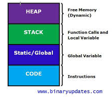

# Osa 6 - Muistinhallinta

## Johdanto

Kun otamme käyttöön muuttujan varaamme muistia järjestelmästämme. Järkevästi muistia käyttävä ohjelma on resurssiedullinen sekä vakaa toimimaan. Kun emme käytä muuttujia turhaan sekä huolehdimme niiden elinkaaresta varmistamme että tietokoneemme muisti pysyy osaltamma yhtenäisenä sekä mahdollisimman vapaana.

Jokainen muuttuja varaa käyttöönsä muistia koko sen elinkaaren ajaksi. Tähän mennessä käyttämiemme muuttujien muisti on siis varattu sen lohkon sisälle jossa olemme funtkion esitelleet. Main-funktiossa varatut muuttujat vapautetaan kun ohjelman suoritus loppuu ja funktiossa varatut aina funtkion loppuessa.



Ohjelman käytössä oleva muisti jakautuu pinomuistiin (stack) sekä kekomuistiin (heap). Molemmat muistit sijaitsevat tietokoneen keskusmuistissa, mutta pinomuisti on jonkin verran nopeampaa käyttää. Pinomuistin toiminta on myös pinomaista ja hyödyntää suoria muistiosoitteita. Pinomaisuus tarkoittaa sitä, että kun kutsumme uutta funktiota tai luomme uusia muuttujia varataan niille tila pinon päältä. Pinomuistin määrä per sovellus saattaa olla osittain rajoitettu. 

Kekomuisti taas toimii hieman hitaammin, sitä käytettäessä muuttujat varataan avoimeen muistilaan eikä välttämättä peräkkäin kuten pinossa. Kekomuistin osalta ohjelmoija on vastuussa muistin varaamisesta ja vapauttamisesta.


Hyvä Youtube video aiheesta:
https://www.youtube.com/watch?v=JNJg3pB_2rY

Sekä hyvä opas:
https://gribblelab.org/CBootCamp/7_Memory_Stack_vs_Heap.html

## Muuttujien elinkaaresta

Kerrataan muutama asia muuttujien elinkaareta. Kun siis käytämme pinomuistia, muisti varataan kun muuttuja otetaan käyttöön, ja muisti vapautuu kun muuttujan näkyvyysalue loppuu
```c++
int main() 
{
    if (true) 
    { //Näkyvyys alue alkaa
        int x = 5; //-> Varataan int-kokoinen tila
    } //Näkyvyys alue loppuu

    // x:n muistialue vapautettu
}
```

Seuraavassa esimerkissä käytetään vastavaa koodia, mutta nyt otamme osoittimen x:n muistipaikkaan

```c++
int main() 
{
    int *p;

    if (true) 
    {
        int x = 5;
        p = &x; //Osoitin x:n muistipaikkaan
    }

    cout << *p << endl; // Mitä tulostuu?
}
```

Edellisessä esimerkissä voi tulostua 5 tai joitain ihan muuta, koska muistialue osoitin on ihan oikein, mutta muistialue saattaa olla jossain muussa käytössä. 

## Kekomuistin käyttö

Edellisen esimerkin myötä huomaamme, että meillä ei vielä ole keinoa toteuttaa funktiota joka varaa muistia ja alustaa sen arvolla, niin että tämä muistialue olisi käytössä kun funktio on suoritettu. 

Esim. jos haluaisimme tehdä funktion joka varaa arvon int-tyyppiselle muuttujalle arvolla 5. Voisimme toteuttaa funktion joka luo arvon, ja palauttaa tähän muistipaikkaan osoittimen:

```c++
int* luoOsoitinArvoonViisi() 
{
    int x = 5;
    return &v;
}

int main() {
 int *p = luoOsoitinArvoonViisi();
 cout << *p << endl; // ???
}
```

Mutta ongelma on että **getPtrToFive** -funktion suorittamisen jälkeen x:n muistialue on jo muuussa käytössä.

Kun käytämme kekomuistia on mahdollista varata muisti ja vapauttaa sitä ohjelmoijan hallinnoimana.

### new operaattori

Kun haluamme varata muistia kekomuistista käytämme **new** -operaatiota. Tämä operaatio palauttaa osoittimen muistipaikkana joka on varattu

```c++
int *x = new int;
```

### delete operaattori

Kun haluamma vapauttaa varaamamme muistin käytämme **delete** -operaatiota.

```c++
delete x;
```

Nyt voimme toteuttaa edellä esitetyn funktion niin, että varaamma muistin funktiossa ja vapautamme sen myöhemmin.

```c++
int* luoOsoitinArvoonViisi() 
{
    int *x = new int;
    *x = 5;
    return x;
}

int main() {
 int *p = luoOsoitinArvoonViisi();
 cout << *p << endl; 
 delete p;

}
```

Huomaa, että jos et vapauta muistia deletellä, ei järjestelmä voi tietää voiko muistialuetta käyttää uudelleen. Näin ollen ohjelmasi syö muistia ja lopulta saataa järjestelmän jumiin. Hyvä sääntö on että jokaista new -operaatiota kohden tulee olla vastaava määrä delete -operaatioita.

HUOM! jos yrität käyttää muistialuetta delete -operaation jälkeen tapahtuu virheellinen viittaus ja ohjelma kaatuu.


## Taulukot ja kekomuisti

Kekomuistin käyttäminen tulee erityisesti kyseeseen isojen taulukoiden sekä olioiden osalta. Näin ei tarvitse pelätä loppuuko tila muistista tai että olion näkyvyysalue loppuisia. Taulukoiden osalta pinosta varatessa meidän tulee tietää taulukon koko, mutta kekoa käytettäessä koko voi tulla muuttujasta.

Kun varaamme taulukolle kekomuistia toimitaan seuraavasti, käyttäen **new[]** -operaatiota varataan muisti. Vastaavasti taulukon muisti vapautetaan **delete[]** -kommennolla.

Taulukkoa käytetään kuten se olisi varattu pinomuistista.

```c++
int numItems;
cout << "Kuinka monta numeroa?";
cin >> numItems;
int *arr = new int[numItems];

//Tallennetaan arvot
for (int i = 0; i < numItems; ++i) 
{
 cout << "Anna arvo taulukkon paikkaan " << i << ": ";
 cin >> arr[i];
}


delete[] arr;
```

## Oliot ja kekomuisti

Myös oliota voidaan varata kekomuistista, tällöinkin käytetään **new** -operaatiota. Esimerkissä käytämme uutta Piste -luokkaa.

```c++
class Piste 
{
    public:
    Piste() 
    {
        x = 0; y = 0; cout << "default konstruktori" << endl;
    }

    Piste(int nx, int ny) 
    {
        x = ny; x = ny; cout << "2-parametrinen konstruktori" << endl;
    }

    ~Point() 
    {
        cout << "tuhoaja kutsuttu" << endl;
    }
    
    int x, y;
};

int main() 
{
    Piste *p = new Piste();
    delete p;

    //Käytetään osoitin uudelleen allokoidaan siihen uusi olio
    p = new Piste(10,20);
    delete p;
}
```

new -operaatiota käytettäess voidaan kutsua joka default konstruktoria ilman parametrejä tai muuta konstruktoria. Kun käytetään **delete** -operaatiota, kutsutaan olion tuhoajaa.

## Tehtäviä


1. Toteuta Polymorphismi -osion tehtävien main() -funktiota käyttämään dynaamista muistia.